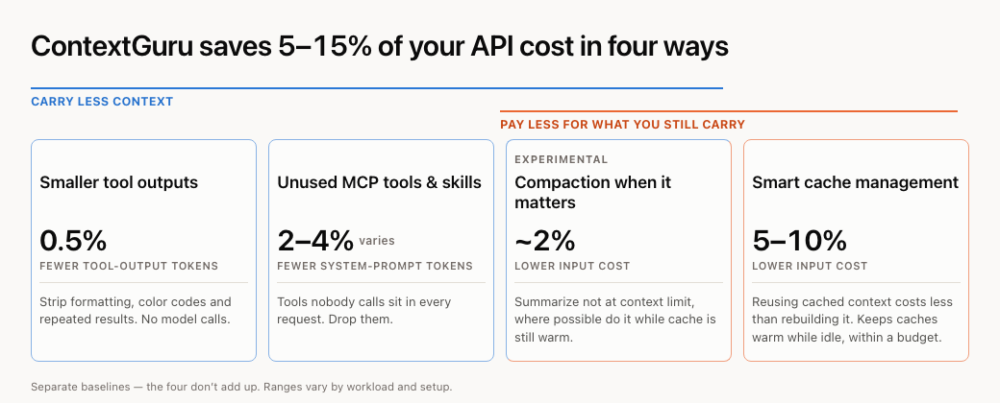

<div align="center">


# context-guru

**Provider-agnostic context engineering for LLM agents.**

[](https://rossoctl.github.io/context-guru/)
[](https://pkg.go.dev/github.com/rossoctl/context-guru)
[](LICENSE)
[](go.mod)

</div>

---

context-guru cuts the token cost of your agent's traffic in two ways: **carry less context**
(drop redundant tool output, collapse superseded runs, summarize before you hit the limit), and
**pay less for what you still carry** (keep your prompt cache warm, split the volatile tail off
the system prompt so the rest stays cacheable). Paying less is the **default** — it's on out of
the box, before you opt into anything that trims content.

<p align="center">

</p>

## Install (Claude Code plugin)

```
/plugin marketplace add rossoctl/context-guru
/plugin install context-guru@context-guru
/reload-plugins     # REQUIRED — without it the next lines answer "Unknown command"
/permissions        # allow  Bash(/Users/you/.claude/plugins/cache/context-guru/**)
                    #   absolute path only; `~` is not expanded in permission rules
/context-guru:install
```

<!-- If you want to install it for your entire org instead of one machine, follow the proxy
     installation guide: docs/setup.md -->

Check what it's saving:

```
/context-guru:status
```

It reports the preset and cache strategy running, and the dollars saved so far — keep-alive
savings, any content-trimming savings, and the net. Sample output and the raw `/stats` endpoint
it reads: [docs/more.md](docs/more.md#claude-code-plugin-advanced-options).

If you want to also carry less, not just pay less, opt into content trimming:

```
/plugin configure   # context-guru → Preset → housellm
```

Everything else — architecture, the full benchmark, every component, the proxy/gateway path,
config reference — is in **[docs/more.md](docs/more.md)**, or the [full docs site](https://rossoctl.github.io/context-guru/).

## License

Apache-2.0. See [LICENSE](LICENSE). A [Rossoctl](https://github.com/rossoctl) platform component.
