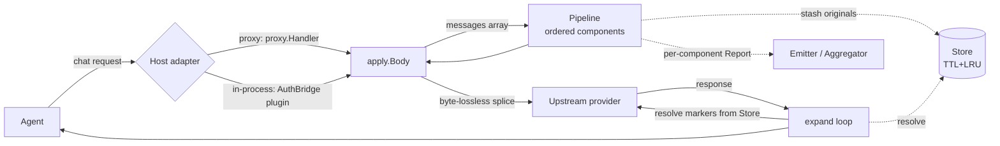
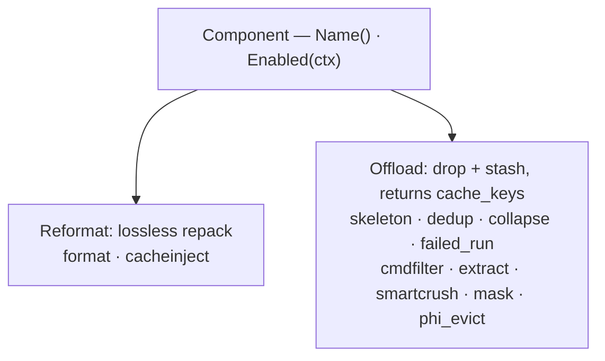

# context-guru

Provider-agnostic **context engineering** for LLM agents: a Go library that shrinks the
tokens a request carries — losslessly, or lossy-but-reversible — without touching the
agent. Same core runs as an **HTTP proxy/gateway** or an **in-process plugin**.

- **Fail open, always** — any component error/panic reverts *that component only*; the
  original request is always a valid fallback.
- **Never worse** — a component that grows the request is reverted.
- **Reversible** — every lossy drop leaves a `<<cg:HASH>>` marker and stashes the original,
  recoverable via a model-callable `context_guru_expand` tool or `GET /expand`.

## Architecture



Components implement one of two lossiness-typed interfaces and are stacked in config order:



## Install

Requires **Go 1.26** and a **C toolchain** (`CGO_ENABLED=1`; the `skeleton` component uses
tree-sitter via cgo). The module pins bifrost with a local `replace` to `../bifrost/core`,
so build from the parent directory that holds both repos:

```sh
cd .../context-engineering            # dir containing lab-context-engineering/ and bifrost/
CGO_ENABLED=1 go build -o bin/context-guru-proxy \
  ./lab-context-engineering/cmd/context-guru-proxy
```

Or build the gateway image (see [docs/setup.md](docs/setup.md)):

```sh
docker build -f lab-context-engineering/Dockerfile -t context-guru:local .
```

## Run the proxy

```sh
context-guru-proxy --preset balanced          # or --config cg.yaml
```

Point any agent at it (one port serves both dialects):

```sh
ANTHROPIC_BASE_URL=http://localhost:4000/anthropic
OPENAI_BASE_URL=http://localhost:4000/openai/v1
```

| Flag / env | Default | Purpose |
|---|---|---|
| `--preset` / `PRESET` | `balanced` | pipeline preset when no `--config` |
| `--config` / `CONFIG` | — | YAML config (overrides preset) |
| `LISTEN_ADDR` | `:4000` | listen address |
| `--openai-upstream` / `OPENAI_UPSTREAM` | `https://api.openai.com` | OpenAI upstream base |
| `--anthropic-upstream` / `ANTHROPIC_UPSTREAM` | `https://api.anthropic.com` | Anthropic upstream base |
| `OPENAI_API_KEY` / `ANTHROPIC_API_KEY` | — | real key injected on forward (gateway mode); empty = pass client auth through |
| `FORCE_MODEL` | — | overwrite the request `model` (eval-containers `EVAL_MODEL`) |

Routes: `POST /openai/v1/chat/completions`, `POST /anthropic/v1/messages`, `GET /healthz`,
`GET /stats` (savings rollups), `GET /expand?id=` (recover an offloaded original).
Per-request: header `x-context-guru-session` sets the session key; `x-context-guru-bypass: true`
skips the pipeline.

## Integrate

| Option | What | Where |
|---|---|---|
| **Proxy / gateway** | `context-guru-proxy` in front of the provider; the eval-containers gateway image | `proxy/`, `cmd/context-guru-proxy/` |
| **In-process plugin** | AuthBridge (Kagenti sidecar) plugin importing this module, running the same pipeline on `pctx.Body` | plugin lives in `kagenti-extensions`; reuses `apply.Body` + `expand/` |
| _(also)_ **bifrost LLMPlugin** | run the pipeline as a `PreRequestHook` inside any bifrost deployment | `adapters/bifrost/` |

Details in [docs/integrations.md](docs/integrations.md).

## Docs

- [docs/design.md](docs/design.md) — architecture: component model, fail-open pipeline, store, session, expand loop, metrics.
- [docs/components.md](docs/components.md) — every registered component: how it works, before→after, lossiness, config, best use.
- [docs/integrations.md](docs/integrations.md) — proxy gateway vs AuthBridge plugin, with request paths.
- [docs/setup.md](docs/setup.md) — setup + a concrete SWE-bench run through the eval-containers gateway.
- [docs/RESULTS.md](docs/RESULTS.md) — per-component SWE-bench benchmark (Claude Code, claude-sonnet-4-6): `mask` ≈27% token savings, no reward loss.

## License

Apache-2.0. See [LICENSE](LICENSE).
