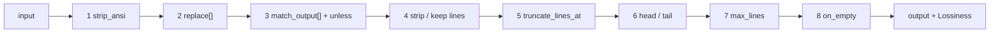

# The DSL filter engine

!!! info "DSL engine — powers `cmdfilter` (lossy)"
    A declarative, user-extensible text-filter engine authored in YAML (no recompile), wrapped by the `cmdfilter` Offload component.

## How it works

`components/dsl` is a declarative, user-extensible text-filter engine (adapted from rtk — see
`THIRD-PARTY-NOTICES`), wrapped by [`cmdfilter`](cmdfilter.md). Filters are authored in YAML (no
recompile), matched by descending `priority` then by name, and each runs a fixed **8-stage**
pipeline. Because filters drop lines they are lossy, which is why the wrapping `cmdfilter` component
is an Offload (it stashes the original first).



## Filter fields

All optional except `match`:

- `match` — regex vs the selector (= first non-empty line)
- `family` — command family for per-family metrics (`builds` / `tests` / `iac` / `pkg` / `net` / …)
- `priority` — match order; higher first, then by name. Absent (`0`) is today's name ordering.
- `strip_ansi`
- `replace` — chained `pattern`→`replacement`, `$1` backrefs
- `match_output` — whole-blob short-circuit: `pattern`/`message`/`unless`
- `strip_lines_matching` **xor** `keep_lines_matching`
- `truncate_lines_at` — per-line char cap
- `head_lines` / `tail_lines`
- `cap` / `cap_reduce` — a shared line budget (see below); an explicit `max_lines` wins
- `max_lines` — absolute cap with omission marker
- `on_empty` — replacement when output is blank

### `priority`, and why order matters more here

`cmdfilter` matches on the *shape of the output*, not on a command, so a generic pattern can shadow a
specific one in a way rtk's command matching never had to deal with. `priority` makes
specific-before-generic explicit instead of dependent on alphabetical luck. Absent, ordering is by
name — exactly the previous behavior.

### Line budgets: `cap` classes

Instead of every filter hand-picking a `max_lines`, a filter selects a budget by **signal density**.
The class names and the first four values are rtk's (`src/core/truncate.rs`); `buildlog` is ours.

| `cap` | lines | for |
|---|--:|---|
| `errors` | 20 | error lists — most actionable, shown the most |
| `warnings` | 10 | warnings and test failures — lower signal density |
| `list` | 20 | flat lists (packages, services): one line per item |
| `inventory` | 50 | exhaustive lookups (installed packages, file listings) |
| `buildlog` | 80 | full build/plan transcripts — verbose, and the signal can sit anywhere |

`cap_reduce: N` lowers the chosen cap for an extra-verbose variant, underflow-safe (a deviation can
never empty the budget — rtk's `reduced` helper). Unknown cap names, and a `cap_reduce` without a
`cap`, are rejected at load. rtk's own TOML filters don't use its cap classes; applying them to the
definitions makes the whole set tunable from one map.

## Lossiness

`Lossiness` is reported back to `cmdfilter`, which uses it to pick the recovery hint:

- **None** — nothing dropped / reversible reformat → no hint
- **Tail** — a clean contiguous tail dropped → the hint names the cut point, because re-reading from
  there is cheaper than pulling the whole blob back
- **Whole** — non-contiguous or whole-blob loss → the hint points at the expand tool

!!! note "Loss-typing fixes"
    Three bugs made a real loss invisible or misleading. All fixed:

    - **`truncate_lines_at` never recorded loss.** It ran before `loss` was initialized, so an
      intra-line cut reported `None` and `cmdfilter` emitted no recovery hint for a real loss. An
      intra-line cut is non-contiguous by nature (every long line loses its own tail), so it now
      types as **Whole**.
    - **`truncate_lines_at` cut silently.** A mid-line cut with no marker reads as corrupted output
      to a model. It now appends `...`, sized to fit *inside* the cap so the line never grows.
    - **The recovery hint collapsed `Tail` and `Whole`.** Both got the same "call
      `context_guru_expand`" text, making a cheap partial recovery look like an expensive one. They
      are now distinct.

## Load-time guardrails

Mirroring rtk's `build.rs`, a filter document fails **at load**, not at first use, when:

- two filters share a name (a silently shadowed filter is a debugging trap);
- a `match` / `replace` / `match_output` / `strip_lines_matching` regex doesn't compile;
- `strip_lines_matching` and `keep_lines_matching` are both set;
- `cap` names an unknown class, or `cap_reduce` is set without `cap`;
- **any inline test in the document fails** — so a broken filter fails loudly instead of quietly
  mangling output.

The shipped filter set must additionally have ≥1 test *per filter*, and each test's input must route
to its own filter (`TestEveryBuiltinFilterHasTestsAndRoutes`). User-supplied documents aren't
required to ship tests, but any they do ship must pass.

## Example

```yaml
schema_version: 1
filters:
  pytest:
    description: keep failures + summary, drop passing noise
    family: tests
    priority: 10
    match: "(pytest|=+ test session starts)"
    strip_lines_matching: ["^\\s*$", " PASSED", "^\\.+$"]
    cap: buildlog
    on_empty: "pytest: all passed"
tests:                       # inline; run at load, and via dsl.RunTests
  pytest:
    - name: all-green
      input: "pytest\n....\n"
      expected: "pytest: all passed"
```

Documents load with `schema_version: 1` and strict unknown-field rejection.

See also: [Components overview](../components.md) · [cmdfilter](cmdfilter.md) ·
[Write a custom DSL filter](../how-to/custom-dsl-filter.md) ·
[Choose a preset](../how-to/choose-a-preset.md)
