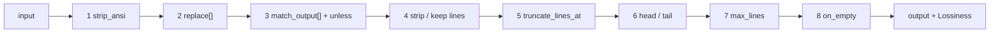

# The DSL filter engine

!!! info "DSL engine — powers `cmdfilter` (lossy)"
    A declarative, user-extensible text-filter engine authored in YAML (no recompile), wrapped by the `cmdfilter` Offload component.

## How it works

`components/dsl` is a declarative, user-extensible text-filter engine (adapted from rtk), wrapped
by [`cmdfilter`](cmdfilter.md). Filters are authored in YAML (no recompile), matched
first-by-sorted-name, and each runs a fixed **8-stage** pipeline. Because filters drop lines they
are lossy, which is why the wrapping `cmdfilter` component is an Offload (it stashes the original
first).



## Filter fields

All optional except `match`:

- `match` — regex vs the selector (= first non-empty line)
- `strip_ansi`
- `replace` — chained `pattern`→`replacement`, `$1` backrefs
- `match_output` — whole-blob short-circuit: `pattern`/`message`/`unless`
- `strip_lines_matching` **xor** `keep_lines_matching`
- `truncate_lines_at` — per-line char cap
- `head_lines` / `tail_lines`
- `max_lines` — absolute cap with omission marker
- `on_empty` — replacement when output is blank

## Lossiness

`Lossiness` is reported back to `cmdfilter` (it drives whether a recovery hint is appended):

- **None** — nothing dropped / reversible reformat
- **Tail** — a clean contiguous tail dropped
- **Whole** — non-contiguous or whole-blob loss

## Example

```yaml
schema_version: 1
filters:
  pytest:
    description: keep failures + summary, drop passing noise
    match: "(pytest|=+ test session starts)"
    strip_lines_matching: ["^\\s*$", " PASSED", "^\\.+$"]
    max_lines: 80
    on_empty: "pytest: all passed"
tests:                       # inline; run via dsl.RunTests (a `verify` command)
  pytest:
    - name: all-green
      input: "pytest\n....\n"
      expected: "pytest: all passed"
```

Documents load with `schema_version: 1` and strict unknown-field rejection. Inline `tests`
(input → expected) run via `dsl.RunTests`, so a filter ships with its own regression check.

See also: [Components overview](../components.md) · [Choose a preset](../how-to/choose-a-preset.md)
