# Dashboard

context-guru ships a **persistent observability dashboard**: an embedded single-page UI
plus a JSON/SSE API, backed by a durable per-request store. It exists to answer one
question honestly — **what value is context-guru providing?** — and to make the answer
falsifiable, including when the answer is "less than you hoped".

```sh
context-guru-proxy --preset codesmart --dashboard
# open http://localhost:4000/dashboard/
```

It is **off by default**. Turning it on adds `/dashboard/` and `/api/*`; every existing
route, including [`/stats`](reference/routes.md), is byte-for-byte unchanged.

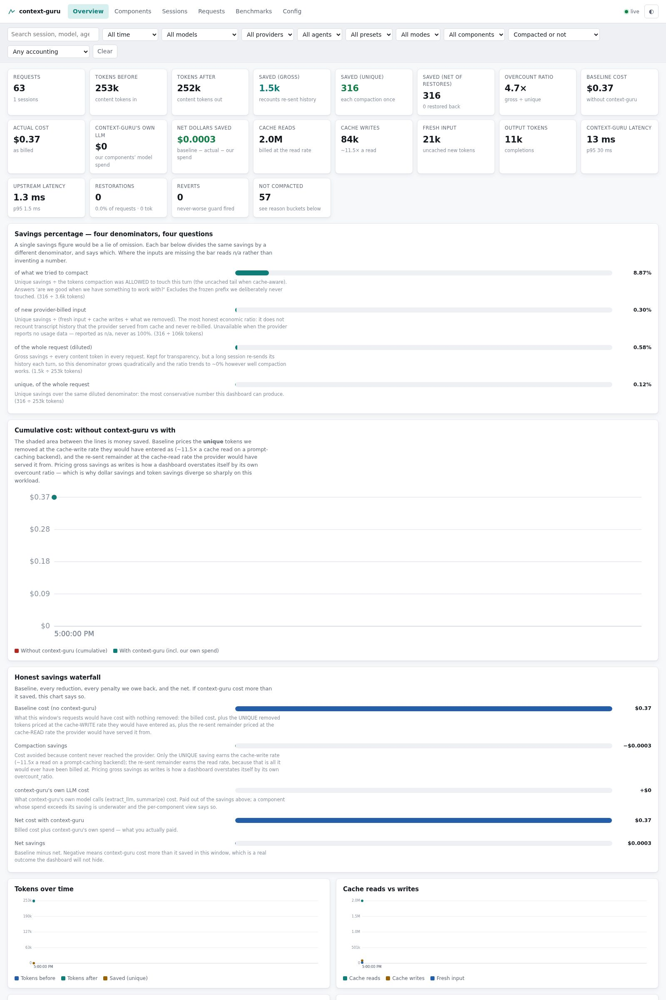

!!! info "No CDN, no build step, no network"
    The whole UI is three files (`index.html`, `style.css`, `app.js`) embedded in the
    binary with `go:embed`, served under a `default-src 'self'` CSP. Charts are
    hand-drawn SVG — no chart library, no framework, no npm. The page fetches nothing
    off-origin, so it works in a VPC or fully air-gapped, and a test asserts that.

## What it shows

### Overview

Every headline number, with the honesty machinery visible rather than hidden:

| Group | Fields |
|---|---|
| Volume | requests · sessions · tokens before/after |
| Savings | gross · unique · net-of-restores · overcount ratio |
| Money | baseline cost · actual cost · context-guru's own LLM spend · net dollars saved |
| Tokens billed | fresh input · cache reads · cache writes · output |
| Latency | context-guru added (mean + **p95**) · upstream (mean + p95) |
| Quality | restorations + rate · reverts · not-compacted count |

Three of those deserve their own explanation.

#### Four savings denominators, not one

A single "savings %" is a lie of omission. The dashboard ships four ratios, each
labelled with **what it divides by**, and each carrying that explanation in the payload
itself (`GET /api/stats` → `denominators[].description`):

| Denominator | Question it answers |
|---|---|
| **of what we tried to compact** | Are we good *when we have something to work with?* Divides by the tokens compaction was allowed to touch — the uncached tail when cache-aware. |
| **of new provider-billed input** | The honest economic ratio. Divides by fresh input + cache writes + what we removed, so transcript history the provider served from cache is not recounted. |
| **of the whole request (diluted)** | Kept for transparency. A long session re-sends its history every turn, so this denominator grows quadratically and trends to ~0% however well compaction works. |
| **unique, of the whole request** | The most conservative figure the dashboard can produce. |

The new-input ratio is guarded: with no provider usage data the denominator would be
`saved` alone and the ratio would read ~100%. It reports **n/a** instead.

#### The cost of our own safety mechanisms

Reported next to their benefit, because a compaction proxy that shows only tokens
removed is unfalsifiable:

- **Frozen for cache safety** — compaction deliberately *not* done on the already-cached
  prefix. Its benefit is the cache reads that stayed cheap; its cost is this.
- **Restored after offload** — content we removed and the model asked back for. A
  premature offload, paid for twice.
- **Reverted component runs** — the never-worse guard firing. Safety working, and its
  cost is the latency of the attempt.
- **context-guru's own latency and LLM spend** — paid out of the savings above.

#### Cumulative cost, with and without

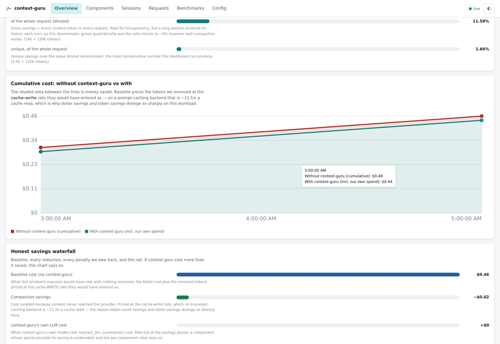

The shaded band between the lines is money saved. Baseline prices the **unique** tokens we
removed at the **cache-write** rate they would have entered as — on a prompt-caching
backend that is ~11.5× a cache read — and the re-sent remainder at the **cache-read** rate
the provider would have served it from. That split is the whole reason token savings and
dollar savings diverge so sharply on this workload (see
[the SWE-bench comparison](results/comparison.md)).

Both halves matter, and getting either wrong inflates the headline. `saved_tokens` is
gross: the agent re-sends its transcript every turn, so one compaction is re-counted once
per remaining turn — a 4.7× overcount on the 63-request replay above, and 13.1× on a
longer one. Only `saved_unique` is content that genuinely never reached the provider, and
only that part can be priced as a cache write; the re-sent remainder would have come from
the provider's cache at 1/11.5 the rate. The dashboard shows the correction factor as
`overcount_ratio` right beside the dollar figure — an earlier version of this page
described pricing gross savings as writes, which overstated net savings by ~9× on the
same data.

Beneath it, the **honest savings waterfall**: baseline → compaction savings →
context-guru's own LLM cost → net cost → net savings. If context-guru cost more than it
saved, the waterfall says so.

### Components — which ones earn their place

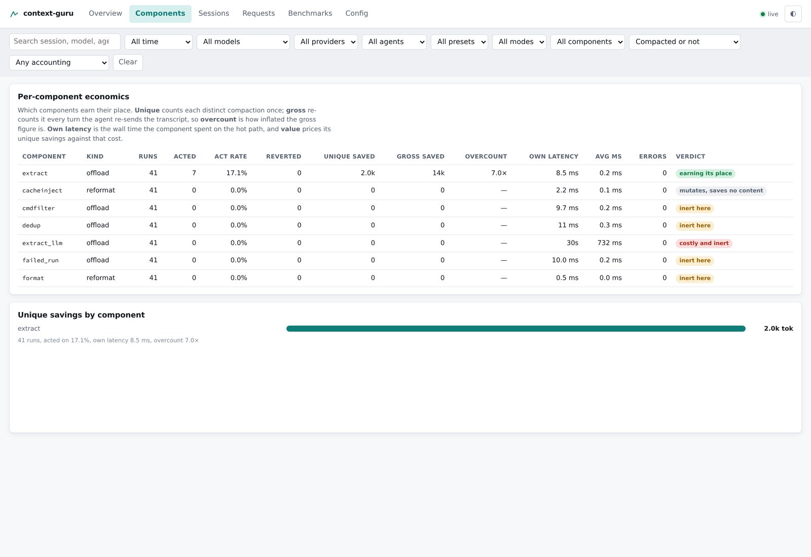

Runs · acted · act rate · reverted · **unique** saved · **gross** saved · **overcount
ratio** · own latency · avg ms · errors, plus a plain-language verdict. On the real
traffic in that screenshot the verdicts are doing their job: `extract` is *earning its
place*, `cacheinject` *mutates, saves no content* (its win is provider-side and invisible
to content-token counts), and a component that burned wall time for nothing reads
*costly and inert*.

`overcount_ratio` is the number that keeps the rest honest: a ratio of 7× means the
gross figure counted the same compaction seven times as the agent re-sent its transcript.

### Sessions

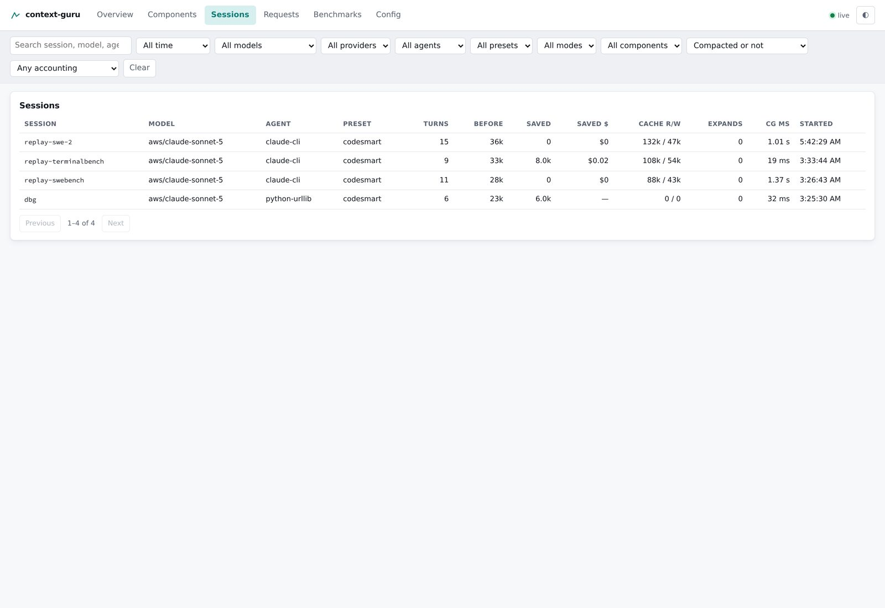

Searchable, filterable, paginated. Per session: model · agent · preset · turns · tokens
before/saved · dollars saved · cache reads/writes · restorations · context-guru latency ·
start time. Clicking a session filters the request list to it.

### Requests, and the diff

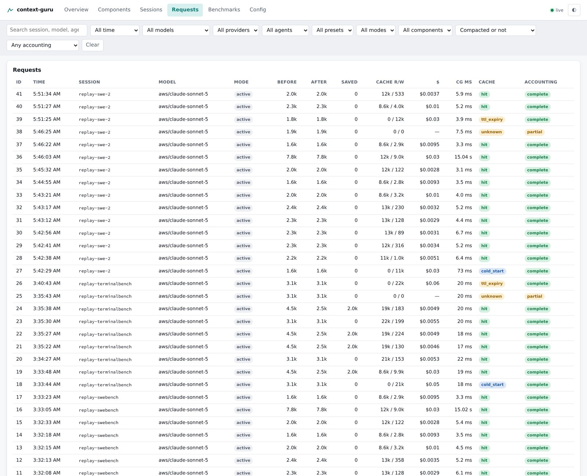

Server-side filters across every dimension, with **keyset** pagination (a cursor, not an
`OFFSET`, so page 500 costs the same as page 1). Click any row for the detail drawer:

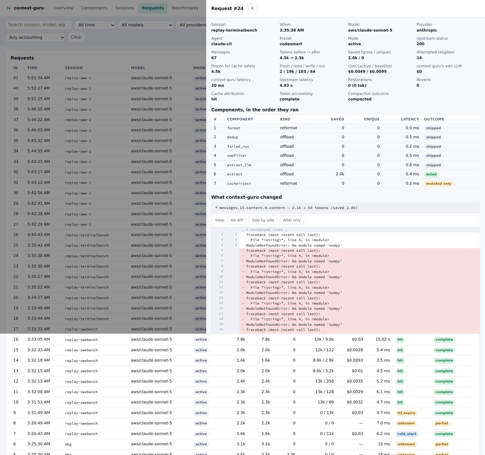

…and, the headline feature, **what context-guru actually did to the wire**:

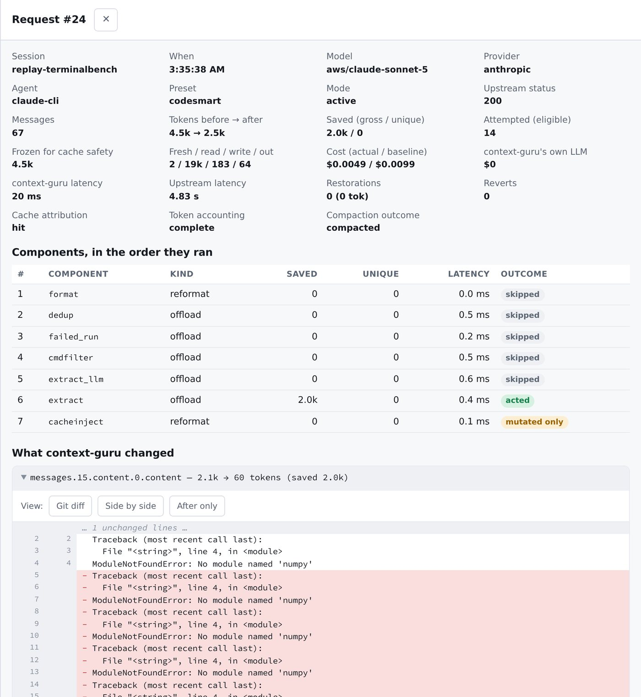

Git-style hunks with line numbers and collapsed unchanged runs, plus side-by-side and
after-only views. Both reference implementations carry this data and neither renders it.

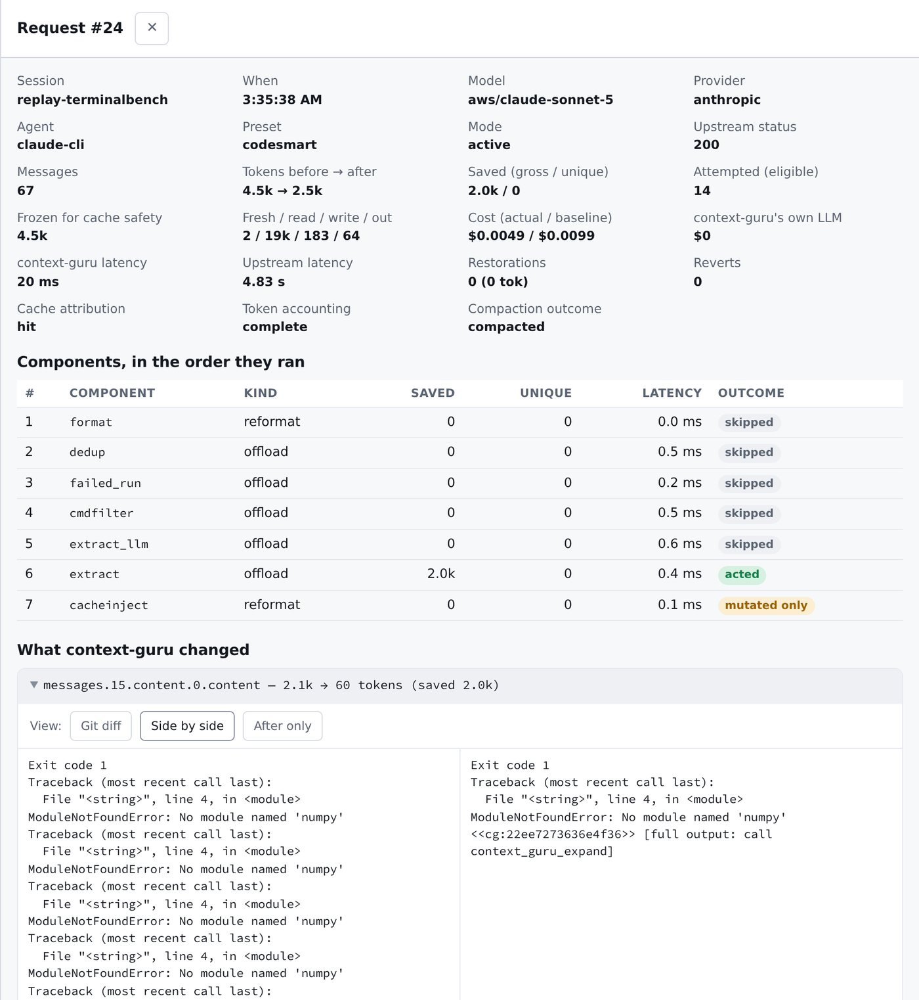

### Benchmarks

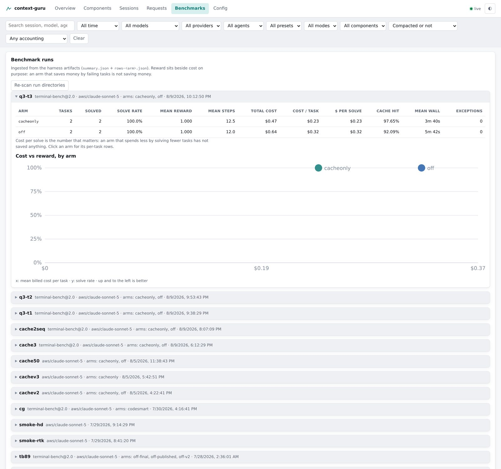

Point `--dashboard-bench-dirs` at a harness jobs root and every run's `summary.json` +
`rows-<arm>.json` is ingested — no new export format. Per arm: tasks · solved · solve
rate · mean reward · mean steps · total cost · cost per task · **cost per solve** · cache
hit rate · mean wall · exceptions, with a cost-vs-reward scatter and per-task drill-down.

Cost per solve is the number that matters: an arm that spends less by solving fewer tasks
has not saved anything.

Re-ingesting replaces a run rather than duplicating it, so restarting the proxy against a
jobs root is idempotent.

### Configuration

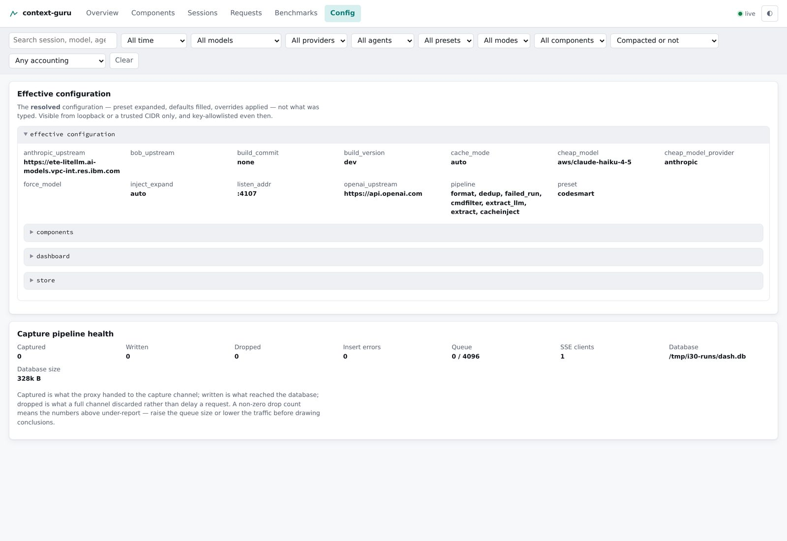

The **resolved** configuration — preset expanded, defaults filled, overrides applied —
not what was typed. Alongside it, the capture pipeline's own health, drop count included.

### Dark mode, small screens, empty states

Dark mode is not a retrofit: the palette is CSS custom properties from line one, and dark
mode redefines only the tokens.

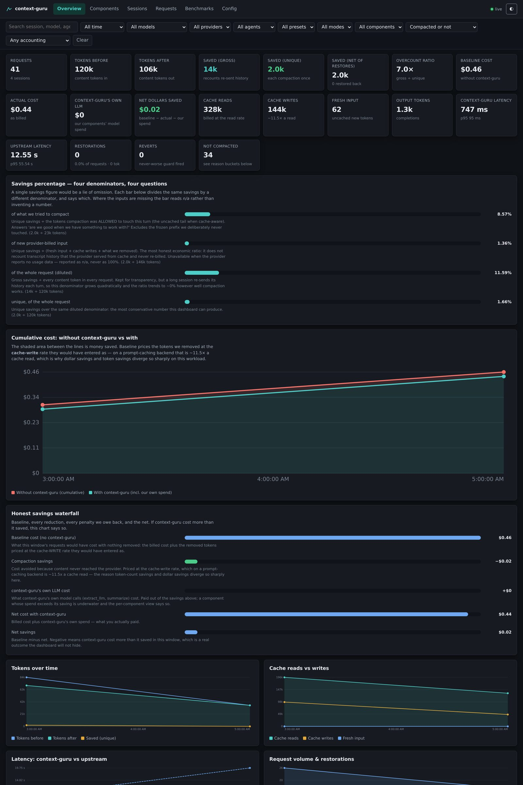

Small viewports reflow; wide tables scroll inside their own container so the page body
never scrolls sideways.

<figure markdown>
  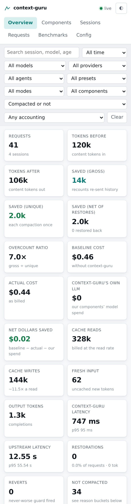{ width="320" }
  <figcaption>390&nbsp;px viewport</figcaption>
</figure>

An empty dashboard reads zero and explains why each panel is blank, rather than
rendering nothing:

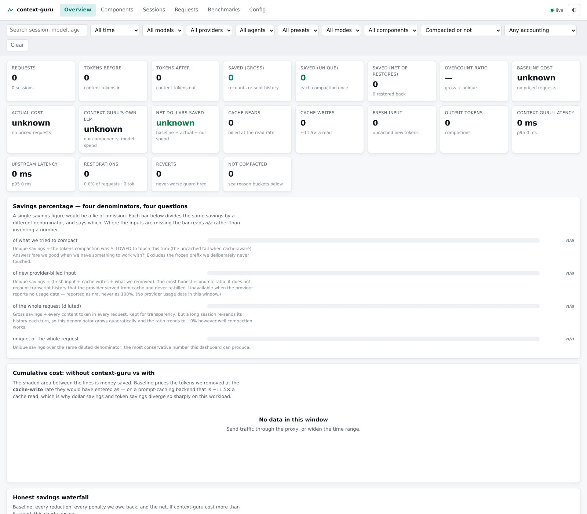

## Honest-metrics rules

The dashboard follows five rules. They are the difference between a dashboard and a
marketing surface.

1. **Every ratio names its denominator.** See above.
2. **Gross, unique and adjusted are visibly distinct.** `overcount_ratio` is surfaced,
   not hidden.
3. **The cost of our own safety mechanisms sits beside their benefit.**
4. **`token_accounting` per row: `complete | partial | missing`.** Only `complete` rows
   have all four billed token tiers. A row we cannot price is rendered as *unknown* —
   never as free, and never as exact.
5. **Cache misses are attributed, and a cold start is not a failure.** Buckets:
   `hit · cold_start · ttl_expiry · prefix_change · unknown`. The first request of a
   session, or the first for a given model, has nothing to hit. TTL expiry wins ties
   against a changed prefix — a prefix that changed after the entry had already expired
   was not the cause.

Plus a sixth, which is really rule 0: **"why didn't you compact this?" is a first-class
answer**, not an absence of data. Buckets: `bypassed · no_messages · below_trigger ·
cache_frozen · found_nothing · reverted`, and an empty reason means we did compact.

## Architecture

```mermaid
flowchart LR
  R[chat request] --> P[pipeline<br/>apply.BodyTrace]
  P --> U[upstream]
  U --> C[client]
  P -. one struct, one<br/>non-blocking send .-> Q[[capture channel<br/>buffered, drops + counts]]
  Q --> W[writer goroutine<br/>batched tx]
  W --> DB[(SQLite<br/>requests · components · content)]
  W --> H[SSE hub]
  DB --> API[/api/*]
  H --> API
  API --> UI[embedded UI]
```

Four properties, in order of importance:

**Capture is off the hot path.** The handler builds one struct from values the request
path already computed and hands it to a buffered channel with a `default:` branch. When
the channel is full the event is **dropped and counted** — never queued into a growing
backlog, never blocking. Observability cannot add latency to, or fail, a request.

**Measured overhead: no detectable per-request cost, content capture included.** Driving
the real handler over one keep-alive connection with a 24-tool-result transcript and
content capture ON, median of 40 paired requests against the same fake upstream: the
dashboard-on figure lands within noise of dashboard-off (repeatedly a shade *below* it).
The channel send itself is ~175 ns (`go test -bench BenchmarkRecord ./dash`).

That second number used to be the only one published, and on its own it was misleading.
`finish` is called from the handler's `defer`, which runs **before the handler returns** —
so work placed there is paid by the next request on a keep-alive connection, i.e. by
every real agent. Content redaction sat there and cost **~53 ms/request**, ~25% of a
request, while the documented figure was "0.000002%". A benchmark that calls `Record`
directly cannot see that, so the guard is now an end-to-end handler-latency test with
content capture on (`TestDashboardAddsNoRequestLatencyWithContentCapture`, budget 5 ms);
putting redaction back on the request goroutine measures +87 ms and fails it.

**Redaction happens before the database, never on read.** Headers are blanket-redacted by
key against a short allowlist; config keys are allowlisted, and an allowlisted key's
*value* is still checked for an embedded `user:password@` credential; captured content is
scrubbed of credential-shaped strings and size-capped. All of it runs on the writer
goroutine, immediately before the INSERT — off the request path, but still before anything
touches disk. A secret that reaches disk is a secret forever, and a redact-on-read filter
is one forgotten code path from leaking it.

Content is the one surface that **cannot** be allowlisted, because it is arbitrary agent
output. It gets pattern scrubbing, and a pattern denylist is structurally always behind
reality: a review of 22 realistic credential shapes found 11 passing through, the worst
being `Authorization: Bearer <token>`, where the pattern matched the scheme and left the
token in the diff view. Those are fixed and pinned by a table-driven test — but 22/22
passing does not prove completeness, which is why **content capture is opt-in**
(`--dashboard-content`, default off) rather than opt-out.

**Percentages at read time, cost at write time.** Every ratio is derived when queried, so
a filter change needs no rebuild; every cost is computed when the row is written, so
history does not silently reprice when a model's published rate changes.

One more, worth stating because it is what we chose *not* to build: **no rollup tables.**
Time series are bucketed in SQL at query time (`ts/bucket*bucket GROUP BY 1`). SQLite
handles millions of rows, and any bucket width works without a migration.

## Storage

SQLite via `modernc.org/sqlite` (pure Go — no C toolchain beyond the one tree-sitter
already requires), in WAL mode.

| Table | Holds |
|---|---|
| `requests` | one row per proxied request: identity, all four token tiers, costs, latencies, attribution |
| `request_components` | one row per component per request — the "which components earn their place" data |
| `request_content` | before/after text, gzip-compressed and size-capped; skippable entirely |
| `bench_runs` / `bench_tasks` | ingested harness runs and their per-task rows |

Timestamps are **epoch milliseconds** everywhere. A formatted locale string cannot be
range-queried, sorted portably, or bucketed; the UI formats in the viewer's locale at
render time.

Retention is bounded by **age and size**: rows older than `--dashboard-retention` are
dropped, then — if the file is still over `--dashboard-max-bytes` — the oldest requests
go until it fits. Age alone cannot bound a burst; size alone silently erases a quiet week.

The schema carries a version. On a mismatch the existing file is **renamed aside**
(`<path>.v<old>.bak`) and a fresh database is created: a dashboard is a derived view, so
discarding history beats refusing to boot, and renaming beats deleting a user's data.

**No-persistence mode:** `--dashboard-db :memory:` keeps everything in RAM. It is also
the automatic fallback when the configured path cannot be opened — the proxy's job is to
proxy, so an unwritable dashboard path logs a warning and degrades rather than failing to
start.

## Access

| Surface | Who can see it |
|---|---|
| Aggregates, series, component and session rollups, request metrics | anyone who can reach the port |
| Per-request **content** (the diff view) | loopback, or an explicit `--dashboard-trusted-cidrs` entry |
| Effective **configuration** | loopback, or a trusted CIDR |

Aggregates are deliberately open: a proxy bound to `0.0.0.0` should still show its own
numbers, and the point of this tool is observability. Content is gated because a
transcript can carry a user's source code. There is **no** "disable observability in
production" switch — for a tool whose value *is* observability, that would be backwards.

## Configuration

See [Config & environment](reference/config.md) for the full flag table. The short
version:

```sh
context-guru-proxy --preset codesmart \
  --dashboard \
  --dashboard-db /var/lib/context-guru/dashboard.db \
  --dashboard-retention 168h \
  --dashboard-max-bytes 1073741824 \
  --dashboard-bench-dirs /var/lib/context-guru/benchruns \
  --dashboard-trusted-cidrs 10.0.0.0/8
```

Every flag has an environment equivalent (`DASHBOARD`, `DASHBOARD_DB`, …) for container
deployments.

## API

See [Routes & headers](reference/routes.md) for the full list. All of it is plain JSON
plus one SSE stream, so the dashboard is not the only possible consumer:

```sh
curl -s localhost:4000/api/stats | jq '.denominators[] | {label, percent, available}'
curl -s 'localhost:4000/api/requests?component=extract&reason=compacted&limit=20'
curl -s 'localhost:4000/api/series?bucket=300000&since=1786300000000'
curl -N  localhost:4000/api/events        # live summary rows over SSE
```

## Verifying it yourself

```sh
CGO_ENABLED=1 go test ./dash/ ./proxy/           # unit + integration
CGO_ENABLED=1 go test -race ./dash/ ./proxy/     # capture path + SSE hub
CGO_ENABLED=1 go test -bench BenchmarkRecord ./dash/   # the overhead number
```

The UI itself is regression-tested two ways: a Go test asserts every stat tile's
`data-testid` exists (and that `app.js` parses — a dropped paren renders a blank page
that no Go test would otherwise catch), and a browser check drives the rendered app
end to end. See [Measure savings](how-to/measure-savings.md) for the workflow.
