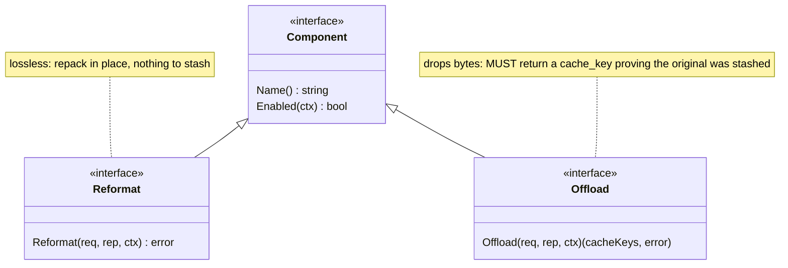
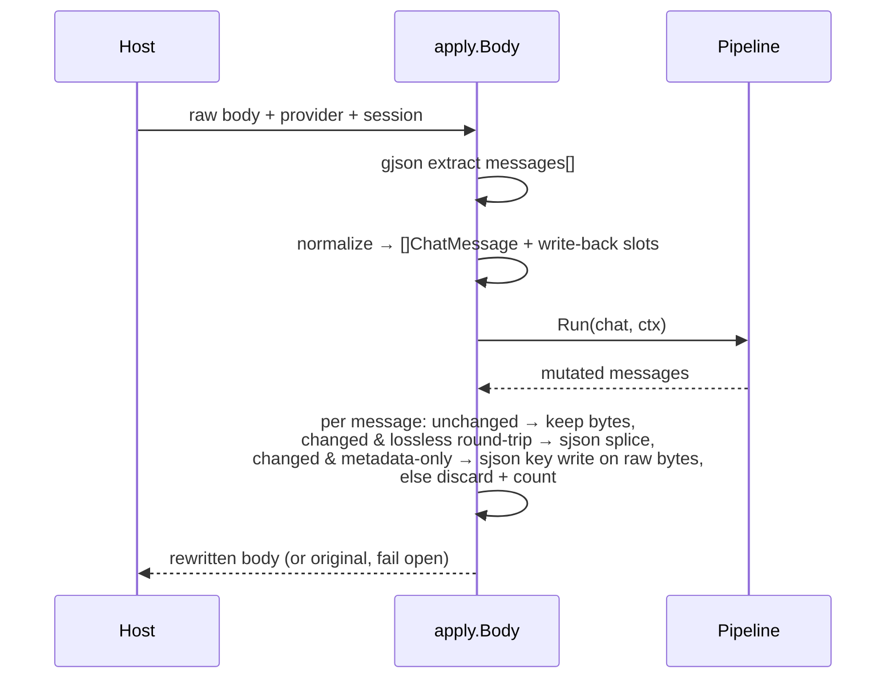
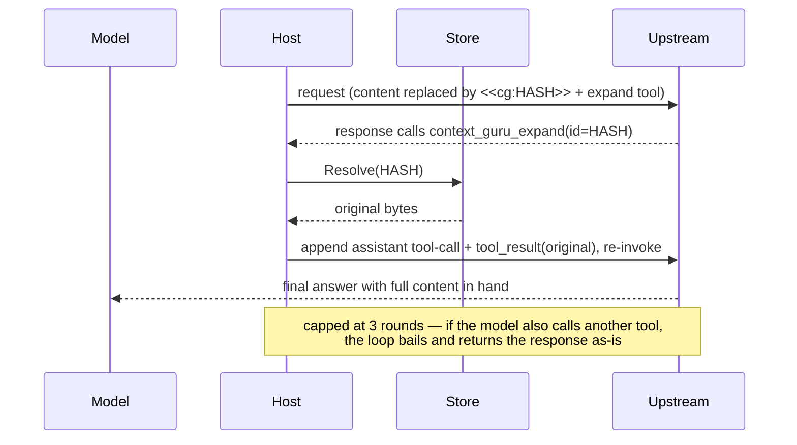

# Design

context-guru is one pure-Go `components` core operating on **bifrost `schemas` types**
(`BifrostChatRequest` / `ChatMessage`), exposing two lossiness-typed interfaces, run in a
**config-ordered, fail-open, never-worse pipeline**, driven unchanged by thin host adapters.
Reversibility, state, session keying, metrics, config, and a filter DSL are the shared
infrastructure the components sit on.

## Package map

| Package | Role |
|---|---|
| `components/` | `Component`/`Reformat`/`Offload` interfaces, `Report`, `Ctx`, the `Pipeline`, the registry |
| `components/reformat/` | lossless components: `format`, `cacheinject` |
| `components/offload/` | lossy-reversible components: `skeleton`, `dedup`, `collapse`, `failed_run`, `cmdfilter`, `extract`, `smartcrush`, `mask` |
| `components/dsl/` | declarative text-filter engine (wrapped by `cmdfilter`) |
| `components/all/` | blank-imports every component so `init()` registrations run |
| `schema/` | helpers over bifrost's schema: token counting, deep-clone, `MessageText`/`SetMessageText`, `Rewritable` |
| `apply/` | the one place the pipeline meets a raw wire body: extract `messages` → run → byte-lossless splice |
| `expand/` | reversibility: `<<cg:HASH>>` marker, the `context_guru_expand` tool def, response parsing + continuation |
| `store/` | `Store` interface + in-memory TTL+LRU backend (rewind + sticky ids) |
| `session/` | resolve the session key (explicit id, else content hash) |
| `metrics/` | `Emitter` implementations: `Slog`, `Aggregator` (for `/stats`), `Tee` |
| `config/` | strict YAML loader, presets, pipeline builder |
| `proxy/` | the standalone/gateway HTTP proxy |
| `adapters/bifrost/` | `LLMPlugin` adapter to embed the pipeline in a bifrost deployment |
| `cmd/context-guru-proxy/` | the proxy binary / eval-containers gateway |

## The component model

Two interfaces, split by **lossiness**, so reversibility is type-enforced:



Optional capability interfaces a component may also implement: `Configurable` (receives its
YAML block as bytes), `NeedsModel` (declares it calls a cheap LLM — the model client is not
yet wired).

- **Reformat** = lossless repack (`format` re-encodes JSON compact; `cacheinject` adds
  `cache_control`). No information leaves the wire, so nothing is stashed.
- **Offload** = lossy-but-reversible. It drops bytes and returns the `cache_keys` under which
  it stashed the originals. If it shrinks the request but returns no keys, the pipeline treats
  it as a **failed offload and reverts** — you cannot silently lose data. Returning no keys and
  leaving the request unchanged is a legitimate no-op (`rep.Skipped`).

## The pipeline: fail-open, never-worse

`Pipeline.Run` walks components in config order. Each is isolated by a snapshot/restore guard
around a per-component `Report`. Token counts are measured on **message content text** (what
the model reads), not the JSON envelope — so `cacheinject` adding `cache_control` bytes never
looks "worse".


Revert conditions (each reverts only that component; the run continues):
1. the component **panicked or returned an error**;
2. an **Offload dropped content but returned no cache_key** (reversibility would be broken);
3. the component **grew** the request (never-worse).

A component registered but implementing neither interface is skipped, not failed.

## Wire ↔ pipeline: `apply.Body`

Both hosts funnel through `apply.Body(ctx, pipe, store, provider, body, session, bypass)`.
It never mutates fields the pipeline didn't touch — **byte-lossless for everything else**.



**Provider normalization.** Components expect OpenAI-shaped tool outputs (`role:"tool"`,
string content). The Anthropic Messages API carries tool outputs as `tool_result` blocks
*inside* user messages — a shape bifrost's schema cannot represent. So for Anthropic requests
`apply` expands each string `tool_result` block into a synthetic `role:tool` message, runs the
pipeline, then splices each rewritten output back into its exact source block via `sjson`.
Non-string tool_result content is skipped (never lose non-text). A whole-message change is only
spliced back if bifrost round-trips that message losslessly (`jsonEqual`); otherwise the change
is discarded — correctness over the marginal saving.

**The metadata exception.** That guard has one deliberate hole, and it exists because the guard
alone made `cacheinject` a no-op. bifrost drops `tool_use.id/name/input` on unmarshal, so every
Anthropic assistant turn carrying a `tool_use` is non-round-trippable — and those are exactly the
only messages `cacheinject` can mark. Measured on 40 captured Claude Code requests: **46
breakpoints applied at the component level, 0 in the output body** (issue #32).

So `apply/metawrite.go` adds a narrow path: when a component's *only* change to a message is an
added `cache_control` key, that key is written at its exact path (`messages.<i>.content.<b>.cache_control`)
on the **original raw bytes** via `sjson`. `cache_control` is metadata, not content — it changes
nothing the model reads, so it needs no message model to express, and a targeted `sjson` write
provably cannot drop a field it never reads. The `metadataOnlyWrites` diff enforces "only that":
a text edit, a removed key, a changed block count, anything else at all, and the change is still
discarded. `applyMetaWrites` additionally refuses if the raw body's block layout disagrees with
the normalized view, so a key can never land on the wrong block, and never overwrites a
breakpoint the caller set.

**Discards are now loud.** `Pipeline.RecordDiscards` attributes each thrown-away change back to
the component that made it (via `Report.ChangedIdx`), surfacing as `discarded_changes` per
component and `top_discarded` in `/stats`. Before this, a mutated-then-discarded component looked
byte-identical to a working Reformat — which is how #32 survived two full benchmark studies.
Attribution is deliberately conservative, because a counter meant to catch that class of bug is
worthless if it cries wolf: `ChangedIdx` is recorded only on the surviving path (a reverted
component is never charged), and one discarded message is charged to exactly ONE component — the
last one to change it, whose state is what the writeback layer actually threw away.

**Breakpoint budgeting is a host job.** The provider caps `cache_control` at 4 across `system` +
`tools` + `messages` together, and a component sees none of the first two. Nor does it see a
`cache_control` on a `tool_result` block: `normalize` rebuilds those into synthetic `role=tool`
messages from text + `tool_use_id` alone (`toolMessage`), dropping the mark. (bifrost is not the
culprit here — it round-trips `cache_control` on `tool_result` fine.) On real Claude Code traffic
that hides all three of the agent's own breakpoints, so a component counting only what it saw
computed 4 free slots when 1 was free. `apply` counts them from the raw body (`wireBreakpoints`,
covering the Bedrock `cachePoint` spelling and its own `system`/`tools` entries) and passes the
total as `Ctx.ExistingBreakpoints`. A breach is logged only when *we* pushed the total over the
cap — an already-over-cap request is forwarded untouched and is not ours to report.

If a component changes the message *count* (none of the v1 set does), the slot map no longer
aligns, so `apply` forwards the original untouched.

Diagnostics: `CONTEXT_GURU_DEBUG=1` logs each tool output's token count + first line;
`CONTEXT_GURU_DUMP=<file>` appends a before→after JSON record per rewritten message.

## Reversibility: marker + expand loop

Offload writes a `<<cg:HASH>>` marker in place of dropped content and calls `store.Put(HASH, original)`.
The host injects a model-callable `context_guru_expand(id)` tool. The **continuation loop** is host
glue (it must re-invoke upstream); the marker format, tool def, response parsing and continuation
builder are shared in `expand/`.



An expired/evicted original resolves to an explicit placeholder rather than being omitted (the
provider requires one `tool_result` per `tool_call_id`). A miss silently turns a lossless offload
lossy — the known TTL edge, much narrower now the TTL slides on every read (see
[Freeze lifetime](#freeze-lifetime-and-which-way-to-fail)).

### The loop on a streaming response

The loop needs a whole assistant message; SSE delivers events. So the host decides per request,
from the request bytes, whether it can afford to look:

- **no marker in `messages`/`system`** → nothing to expand → stream through untouched;
- **marker present** → buffer the stream, rebuild the message with `expand.AggregateSSE`
  (Anthropic dialect only — other dialects return `ok=false` and are replayed raw), inspect, and
  either continue the loop or replay the buffered bytes verbatim.

Buffering is the one thing that turns a stream into a non-stream, so the marker test must be tight
in *both* directions: a false negative loses a real expand call, a false positive silently costs
every request its time-to-first-byte. It scans only model-visible content (`messages`, `system`) —
scanning the whole body also matched the expand tool description the host injects itself, which made
it unconditionally true (issue #26). `/stats` exposes `sse_streamed` / `sse_buffered` /
`sse_buffered_pct` and the two TTFB averages so the fast path is measured, not assumed.

**Markers on the wire are usually HTML-escaped.** `encoding/json` escapes `<` by default — a caller
can opt out with `Encoder.SetEscapeHTML(false)`, and some non-Go clients never escape it — and `sjson`
escapes it whenever the value contains a newline, which is how every marker is appended. So `<<cg:H>>`
in the model's view is normally `<<cg:H>>` in the bytes. Marker matching on *decoded* content
(`expand.HasPlaceholder`, used by the components) sees the plain form; matching on *raw request
bytes* (`expand.rawMarkerRe`, used by the host's streaming decision) must accept both, and does.

## State: the Store

One `Store` interface, in-memory TTL+LRU default (both hosts share it). Defaults: **10000s TTL,
1000 entries, 100 sticky sessions**. It carries, keyed per session:

- **Rewind** — `cache_key → original bytes` (what the expand loop resolves).
- **Sticky** — the set of content ids already reduced on prior turns (for byte-stable output
  across turns; scaffolding for cache stability).

SQLite/Redis slot in behind the same interface when a durable/multi-replica deployment is real.

### Freeze lifetime, and which way to fail

The TTL exists to reclaim state for **finished** sessions. Applying it to a *live* one is a bug
with a price tag: a frozen compaction (`cg:frz:…`, the exact replacement bytes an offloader must
replay so an already-cached message stays byte-identical) that dies mid-task makes that message
flip representation inside the provider's cached prefix, and the whole suffix is re-written at
**11.5x** the cache-read price. So the store treats a *read* as proof of life:

- **Sliding TTL** — `Get` refreshes `expires`, not just LRU recency. An entry being replayed every
  turn never ages out; one nobody reads still expires on its original deadline.
- **Default 10000s** — Terminal-Bench tasks average ~1975s of wall clock and run to 4h, so the
  old 1800s default expired live decisions mid-task. Still `store.ttl_seconds`.
- **Replay decisions are pinned** against LRU eviction — `cg:frz:` (mask/failed_run), `cg:res:`
  (extract_llm's projection *and* its summary line, one key so they cannot half-survive) and
  `cg:len:` (apply's cache-boundary counter, whose loss makes `TailOnly` fail open). All are tiny;
  the pin is capped at half the entry cap so one session cannot starve the rewind stashes the
  expand loop needs. Eviction reclaims **expired** entries first, pinned included — otherwise a
  finished session's decisions are never read again, never expire, and permanently occupy the pin
  budget. The prefixes are supplied by their owners via `store.Options.PinPrefixes`; the store
  does not know component key layouts.

**The fail direction inverts for an established compaction.** Fail-open normally means "forward the
original", and for a *new* compaction that is right. But once the provider has cached the compacted
bytes, forwarding the original **is** the destructive act. A plain `Get` miss can't tell those cases
apart, so the store keeps the *fact* of a dropped freeze (`FrozenLoser.FrozenLost`, a bounded key
set — the payload need not survive, only the knowledge that it existed):

- **never frozen** → obey the tail gate; a new compaction stays in the uncached tail.
- **frozen, then lost** → re-derive it even at depth, but **only where re-derivation is
  reproducible**. `mask` and `failed_run` qualify: their replacement is
  `prefix + headPeek(content) + Marker(sha256(content))`, a pure function of
  `(content, config)` and independent of position, so re-deriving reproduces the *same* bytes the
  provider cached and re-establishes the freeze. Their windows (`keep_recent`, `runs[:len-1]`) gate
  *whether* a message is considered, never *what bytes* are emitted, and config cannot drift
  mid-session. The never-worse and kept-verbatim guards still apply, so the repair only lifts the
  depth restriction — it never authorizes new content loss.
- **`extract_llm` is deliberately excluded.** Its replacement is a *sampled* model output (the
  cheap-model client sends no temperature and no seed), so re-deriving could splice **different**
  bytes into the cached prefix — the exact corruption the repair exists to prevent. And the trade
  does not pay even ignoring that: if the bytes differ, the suffix is cache-written either way, so
  the repair branch would buy a model call for nothing. There is no upside, so a lost `extract_llm`
  decision simply declines and the message is forwarded verbatim. (Its entry is still pinned, so
  the common case is that it is never lost at all.) Re-enabling it would need deterministic
  decoding *plus* a check that the re-derived bytes match the stored hash before splicing.

`/stats` reports `frozen_hits`, `frozen_misses`, `frozen_dropped`, `frozen_repaired`, and
`frozen_flips` (= dropped − repaired; should be 0). `frozen_misses` is a *lookup* counter dominated
by the ordinary "not compacted yet" case — `frozen_dropped` is the one that measures harm. See
[Routes](reference/routes.md#stats-freeze-replay-fields).

The related fail-*open* on `MaxCachedIdx`: `prevLen` returning 0 on a store miss yields
`MaxCachedIdx = -1`, and `Ctx.TailOnly` then permits mutating any index (measured on 11.2% of
Terminal-Bench requests). `cg:len:` is now pinned and the sliding TTL keeps it alive, so it
no longer expires mid-session — but inverting `TailOnly` to fail *closed* is a separate change.

## Session keying

`session.Resolve(explicit, system, firstUser)`: an explicit host id wins; otherwise a stable
`sha256(system + firstUser)[:16]` so two turns of one conversation land on the same key.
Explicit id sources: proxy header `x-context-guru-session`; AuthBridge `pctx.Session`;
eval-containers stamps it in the gateway.

## Metrics

The pipeline depends only on the `Emitter` interface (`Component(Report)` + `Run(RunReport)`),
so it has no telemetry-backend dependency. Implementations: `Slog` (logs in `context_engineering.*`
vocabulary), `Aggregator` (in-process rollups behind `/stats`), `Tee` (fan-out), `NopEmitter`.

`/stats` savings are **token-weighted** (Σ saved / Σ before), the honest aggregate — not a mean
of per-request percentages. It also reports:
- `wasted_tokens` / `bounces` — content offloaded then re-served via expand (a premature offload);
- `adjusted_saved` = saved − wasted (bounce-adjusted, may be negative);
- `top_passthrough` — components that ran but never changed a request: dead weight to drop;
- `sse_streamed` / `sse_buffered` / `sse_buffered_pct` and `sse_ttfb_ms_avg` /
  `sse_ttfb_ms_avg_buffered` — streaming health: how many SSE responses had to be buffered whole to
  be inspected for an expand call, and what that cost in time-to-first-byte.

Fields are only ever **added** to `/stats`; the harbor harnesses parse it, so no field is renamed
or removed.

## Config & registry

One strict YAML struct serves both hosts. `pipeline:` is an ordered name-list (order +
enablement); each component's typed block lives under `components:<name>` and is handed to its
constructor verbatim. A `preset` expands to a default pipeline; explicit fields override it.
Unknown keys are rejected.

```yaml
preset: balanced
pipeline: [format, dedup, failed_run, cmdfilter, cacheinject]   # order + enable
components:
  collapse:   { max_tokens: 2000, head_lines: 20, tail_lines: 20 }
  smartcrush: { min_items: 5, keep_first: 3, keep_last: 2 }
store: { ttl_seconds: 10000, max_entries: 1000 }
```

A component registers its constructor + config type via `init()`; adding one makes it
YAML-configurable with no core edit. See [components.md](components.md) for presets and every
component's config.

## LLM components

Most components are deterministic. Two call an LLM: `extract` (`strategy: code`/`rlm`, a Starlark
filter run in a sandbox) and `summarize` (whole-transcript summary). They implement `NeedsModel` and
call `Ctx.Model` — a `ModelSpec` the host resolves per request:

```mermaid
flowchart LR
  cfg["component config<br/>model.source"] --> res{"ModelSpec.For(source)"}
  res -->|incoming| inc["Incoming: request's own<br/>model + upstream + key<br/>(built in proxy.chat)"]
  res -->|config| stat["Static: cheap model<br/>(CHEAP_MODEL* env)"]
  res -->|nil| deg["degrade: extract→deterministic,<br/>summarize→no-op"]
  inc --> call["Model.Complete(ctx, prompt)"]
  stat --> call
```

- **`incoming`** (default) reuses the proxied request's model + the gateway's key — zero extra config,
  works through the eval-containers gateway. **`config`** uses a dedicated cheap model (`internal/cheapmodel`
  Anthropic/OpenAI). The AuthBridge host offers only `config` (its incoming key is a placeholder).
- The call is synchronous in the request path, so it's bounded (short timeout, retry) and **fail-open**:
  any error reverts the component (pipeline guarantee), and a missing model degrades gracefully.
- Reversibility is unchanged — the LLM output is still stashed under a `<<cg:HASH>>` marker for `expand`.
