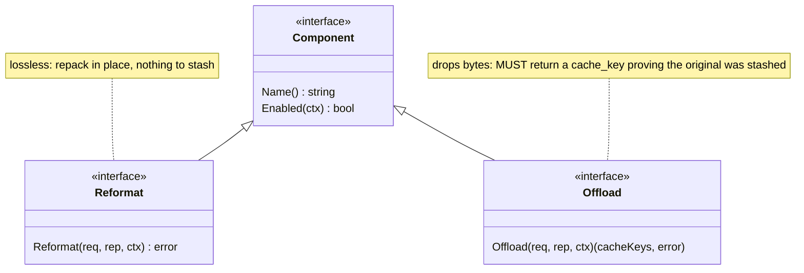
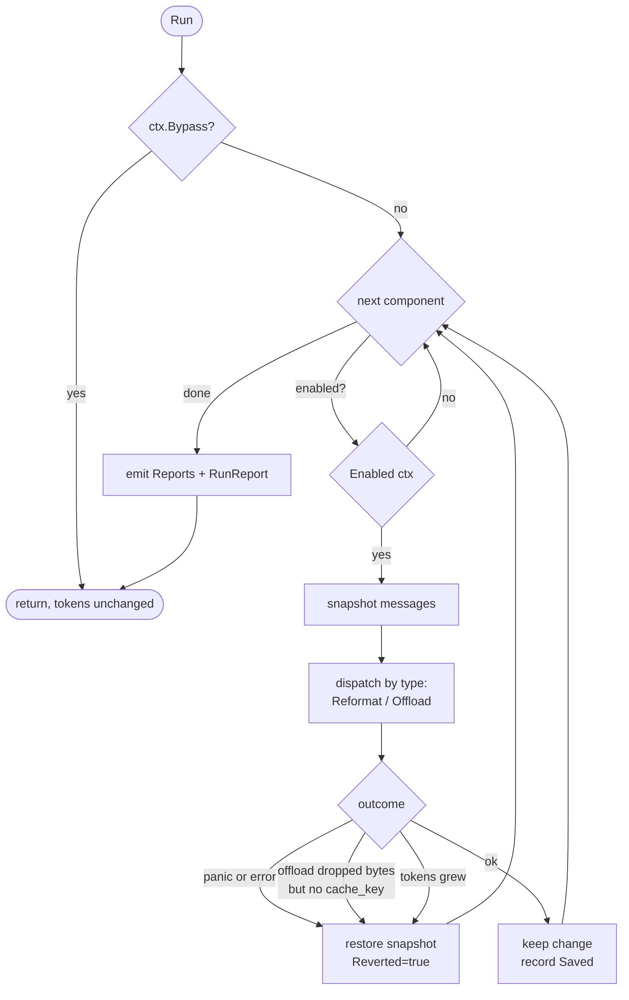

# Design

context-guru is one pure-Go `components` core operating on **bifrost `schemas` types**
(`BifrostChatRequest` / `ChatMessage`), exposing two lossiness-typed interfaces, run in a
**config-ordered, fail-open, never-worse pipeline**, driven unchanged by thin host adapters.
Reversibility, state, session keying, metrics, config, and a filter DSL are the shared
infrastructure the components sit on.

## Package map

| Package | Role |
|---|---|
| `components/` | `Component`/`Reformat`/`Offload` interfaces, `Report`, `Ctx`, the `Pipeline`, the registry |
| `components/reformat/` | lossless components: `format`, `cacheinject` |
| `components/offload/` | lossy-reversible components: `skeleton`, `dedup`, `collapse`, `failed_run`, `cmdfilter`, `extract`, `smartcrush`, `mask`, `phi_evict` |
| `components/dsl/` | declarative text-filter engine (wrapped by `cmdfilter`) |
| `components/all/` | blank-imports every component so `init()` registrations run |
| `schema/` | helpers over bifrost's schema: token counting, deep-clone, `MessageText`/`SetMessageText`, `Rewritable` |
| `apply/` | the one place the pipeline meets a raw wire body: extract `messages` → run → byte-lossless splice |
| `expand/` | reversibility: `<<cg:HASH>>` marker, the `context_guru_expand` tool def, response parsing + continuation |
| `store/` | `Store` interface + in-memory TTL+LRU backend (rewind + sticky ids) |
| `session/` | resolve the session key (explicit id, else content hash) |
| `metrics/` | `Emitter` implementations: `Slog`, `Aggregator` (for `/stats`), `Tee` |
| `config/` | strict YAML loader, presets, pipeline builder |
| `proxy/` | the standalone/gateway HTTP proxy |
| `adapters/bifrost/` | `LLMPlugin` adapter to embed the pipeline in a bifrost deployment |
| `cmd/context-guru-proxy/` | the proxy binary / eval-containers gateway |

## The component model

Two interfaces, split by **lossiness**, so reversibility is type-enforced:



Optional capability interfaces a component may also implement: `Configurable` (receives its
YAML block as bytes), `NeedsModel` (declares it calls a cheap LLM — the model client is not
yet wired).

- **Reformat** = lossless repack (`format` re-encodes JSON compact; `cacheinject` adds
  `cache_control`). No information leaves the wire, so nothing is stashed.
- **Offload** = lossy-but-reversible. It drops bytes and returns the `cache_keys` under which
  it stashed the originals. If it shrinks the request but returns no keys, the pipeline treats
  it as a **failed offload and reverts** — you cannot silently lose data. Returning no keys and
  leaving the request unchanged is a legitimate no-op (`rep.Skipped`).

## The pipeline: fail-open, never-worse

`Pipeline.Run` walks components in config order. Each is isolated by a snapshot/restore guard
around a per-component `Report`. Token counts are measured on **message content text** (what
the model reads), not the JSON envelope — so `cacheinject` adding `cache_control` bytes never
looks "worse".



Revert conditions (each reverts only that component; the run continues):
1. the component **panicked or returned an error**;
2. an **Offload dropped content but returned no cache_key** (reversibility would be broken);
3. the component **grew** the request (never-worse).

A component registered but implementing neither interface is skipped, not failed.

## Wire ↔ pipeline: `apply.Body`

Both hosts funnel through `apply.Body(ctx, pipe, store, provider, body, session, bypass)`.
It never mutates fields the pipeline didn't touch — **byte-lossless for everything else**.

```mermaid
sequenceDiagram
  participant Host
  participant apply as apply.Body
  participant Pipe as Pipeline
  Host->>apply: raw body + provider + session
  apply->>apply: gjson extract messages[]
  apply->>apply: normalize → []ChatMessage + write-back slots
  apply->>Pipe: Run(chat, ctx)
  Pipe-->>apply: mutated messages
  apply->>apply: per message: unchanged → keep bytes;<br/>changed & lossless round-trip → sjson splice
  apply-->>Host: rewritten body (or original, fail open)
```

**Provider normalization.** Components expect OpenAI-shaped tool outputs (`role:"tool"`,
string content). The Anthropic Messages API carries tool outputs as `tool_result` blocks
*inside* user messages — a shape bifrost's schema cannot represent. So for Anthropic requests
`apply` expands each string `tool_result` block into a synthetic `role:tool` message, runs the
pipeline, then splices each rewritten output back into its exact source block via `sjson`.
Non-string tool_result content is skipped (never lose non-text). A whole-message change is only
spliced back if bifrost round-trips that message losslessly (`jsonEqual`); otherwise the change
is discarded — correctness over the marginal saving.

If a component changes the message *count* (none of the v1 set does), the slot map no longer
aligns, so `apply` forwards the original untouched.

Diagnostics: `CONTEXT_GURU_DEBUG=1` logs each tool output's token count + first line;
`CONTEXT_GURU_DUMP=<file>` appends a before→after JSON record per rewritten message.

## Reversibility: marker + expand loop

Offload writes a `<<cg:HASH>>` marker in place of dropped content and calls `store.Put(HASH, original)`.
The host injects a model-callable `context_guru_expand(id)` tool. The **continuation loop** is host
glue (it must re-invoke upstream); the marker format, tool def, response parsing and continuation
builder are shared in `expand/`.

```mermaid
sequenceDiagram
  participant M as Model
  participant Host
  participant Store
  participant Up as Upstream
  Host->>Up: request (content replaced by <<cg:HASH>> + expand tool)
  Up-->>Host: response calls context_guru_expand(id=HASH)
  Host->>Store: Resolve(HASH)
  Store-->>Host: original bytes
  Host->>Up: append assistant tool-call + tool_result(original), re-invoke
  Up-->>M: final answer with full content in hand
  Note over Host,Up: capped at 3 rounds; if the model also calls another tool,<br/>the loop bails and returns the response as-is
```

An expired/evicted original resolves to an explicit placeholder rather than being omitted (the
provider requires one `tool_result` per `tool_call_id`). A miss silently turns a lossless offload
lossy — the known TTL edge.

## State: the Store

One `Store` interface, in-memory TTL+LRU default (both hosts share it). Defaults: **1800s TTL,
1000 entries, 100 sticky sessions**. It carries, keyed per session:

- **Rewind** — `cache_key → original bytes` (what the expand loop resolves).
- **Sticky** — the set of content ids already reduced on prior turns (for byte-stable output
  across turns; scaffolding for cache stability).

SQLite/Redis slot in behind the same interface when a durable/multi-replica deployment is real.

## Session keying

`session.Resolve(explicit, system, firstUser)`: an explicit host id wins; otherwise a stable
`sha256(system + firstUser)[:16]` so two turns of one conversation land on the same key.
Explicit id sources: proxy header `x-context-guru-session`; AuthBridge `pctx.Session`;
eval-containers stamps it in the gateway.

## Metrics

The pipeline depends only on the `Emitter` interface (`Component(Report)` + `Run(RunReport)`),
so it has no telemetry-backend dependency. Implementations: `Slog` (logs in `context_engineering.*`
vocabulary), `Aggregator` (in-process rollups behind `/stats`), `Tee` (fan-out), `NopEmitter`.

`/stats` savings are **token-weighted** (Σ saved / Σ before), the honest aggregate — not a mean
of per-request percentages. It also reports:
- `wasted_tokens` / `bounces` — content offloaded then re-served via expand (a premature offload);
- `adjusted_saved` = saved − wasted (bounce-adjusted, may be negative);
- `top_passthrough` — components that ran but never changed a request: dead weight to drop.

## Config & registry

One strict YAML struct serves both hosts. `pipeline:` is an ordered name-list (order +
enablement); each component's typed block lives under `components:<name>` and is handed to its
constructor verbatim. A `preset` expands to a default pipeline; explicit fields override it.
Unknown keys are rejected.

```yaml
preset: balanced
pipeline: [format, dedup, failed_run, cmdfilter, cacheinject]   # order + enable
components:
  collapse:   { max_tokens: 2000, head_lines: 20, tail_lines: 20 }
  smartcrush: { min_items: 5, keep_first: 3, keep_last: 2 }
store: { ttl_seconds: 1800, max_entries: 1000 }
```

A component registers its constructor + config type via `init()`; adding one makes it
YAML-configurable with no core edit. See [components.md](components.md) for presets and every
component's config.

## LLM components

Most components are deterministic. Two call an LLM: `extract` (`strategy: code`/`rlm`, a Starlark
filter run in a sandbox) and `summarize` (whole-transcript summary). They implement `NeedsModel` and
call `Ctx.Model` — a `ModelSpec` the host resolves per request:

```mermaid
flowchart LR
  cfg["component config<br/>model.source"] --> res{"ModelSpec.For(source)"}
  res -->|incoming| inc["Incoming: request's own<br/>model + upstream + key<br/>(built in proxy.chat)"]
  res -->|config| stat["Static: cheap model<br/>(CHEAP_MODEL* env)"]
  res -->|nil| deg["degrade: extract→deterministic,<br/>summarize→no-op"]
  inc --> call["Model.Complete(ctx, prompt)"]
  stat --> call
```

- **`incoming`** (default) reuses the proxied request's model + the gateway's key — zero extra config,
  works through the eval-containers gateway. **`config`** uses a dedicated cheap model (`internal/cheapmodel`
  Anthropic/OpenAI). The AuthBridge host offers only `config` (its incoming key is a placeholder).
- The call is synchronous in the request path, so it's bounded (short timeout, retry) and **fail-open**:
  any error reverts the component (pipeline guarantee), and a missing model degrades gracefully.
- Reversibility is unchanged — the LLM output is still stashed under a `<<cg:HASH>>` marker for `expand`.
