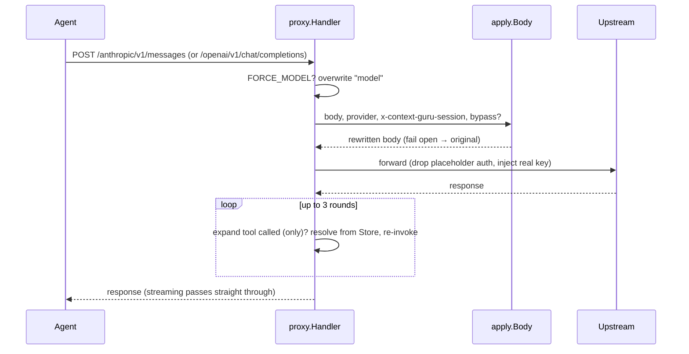

# Run as a bifrost LLMPlugin

`adapters/bifrost.Plugin` implements bifrost's `schemas.LLMPlugin`. Register it in
`BifrostConfig.LLMPlugins` and the context-guru pipeline runs as a `PreRequestHook` inside any
bifrost proxy — no separate process, no transport of its own.

```go
p := bifrost.New(pipe, store)   // pipe from config.Build, store from config.NewStore
// register p in BifrostConfig.LLMPlugins
```

## Where it sits

- **`PreRequestHook`** runs the pipeline over `req.ChatRequest` in place — the canonical mutate
  phase. Non-chat requests pass through. It never aborts a request; fail-open lives inside the
  pipeline itself.
- **Session id** comes from the `context-guru-session` context value (set by the transport from the
  request header or Anthropic `metadata.user_id`), falling back to the content hash.
- **`PreLLMHook` / `PostLLMHook` are pass-throughs.** The expand loop is *not* a hook — it must
  re-invoke upstream, which a hook cannot. It belongs in a transport wrapper that reuses the shared
  [`expand/`](recover-context.md) package + [store](recover-context.md) on the response path, the
  same way the other hosts do.

!!! note "Reuses the shared core"
    Like every host, the bifrost plugin drives the one pipeline over the one bifrost schema. The
    request path is `apply`-style pipeline execution; the response path reuses `expand/` + the
    `Store` to resolve `<<cg:HASH>>` markers. See [Architecture](../design.md).

## The request → expand-loop flow

The transport wrapper mirrors the shipped proxy: run the pipeline, forward, then run the expand
loop server-side (capped at 3 rounds) before returning. This is the same flow the bifrost wrapper
implements around the plugin's `PreRequestHook`.



## The three host adapters

The same core runs behind three hosts; they differ only in how they obtain the body, provider, and
session id, and where they run the expand loop.

| Option | Host code | Body source | Expand loop |
|---|---|---|---|
| **Proxy / gateway** | `proxy/` + `cmd/context-guru-proxy/` | HTTP request body | server-side, wraps the chat route |
| **AuthBridge plugin** | `kagenti-extensions` (imports this module) | `pctx.Body` | response path (`OnResponse`) |
| **bifrost `LLMPlugin`** | `adapters/bifrost/` | `req.ChatRequest` | transport wrapper |

- **Proxy / gateway** — a standalone HTTP proxy that reuses bifrost's `ChatMessage` type (not its
  transport). One port serves both dialects; runs the expand loop itself.
- **AuthBridge in-process plugin** — an outbound `WritesBody` plugin living in `kagenti-extensions`,
  reusing `apply.Body` on `pctx.Body` and running the continuation in `OnResponse`.
- **bifrost `LLMPlugin`** — this page: embed the pipeline in an existing bifrost deployment via a
  `PreRequestHook`.

For the proxy and AuthBridge paths in full, see
[Run behind a proxy or gateway](../integrations.md).
