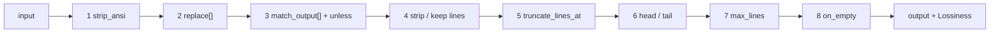

# Author a custom DSL filter

`components/dsl` is a declarative, user-extensible text-filter engine (adapted from rtk), wrapped by
the [`cmdfilter`](../components/cmdfilter.md) component. Filters are authored in YAML — **no
recompile** — matched first-by-sorted-name, and each runs a fixed 8-stage pipeline. Because filters
drop lines they are lossy, which is why the wrapping `cmdfilter` is an
[Offload](../components.md#offload-lossy-reversible): it stashes the original first and appends a
`<<cg:HASH>>` recovery hint only when the filter was actually lossy.

## The 8-stage pipeline

A matched filter runs its input through these stages in order:



The engine reports `Lossiness` back to `cmdfilter`, which drives the recovery hint: `None` (nothing
dropped / reversible reformat), `Tail` (a clean contiguous tail dropped), `Whole` (non-contiguous or
whole-blob loss).

## Filter fields

All optional except `match`.

| Field | Purpose |
|---|---|
| `match` | regex tested against the **selector** (the output's first non-empty line) — decides if this filter applies |
| `strip_ansi` | strip ANSI escape codes |
| `replace` | chained `pattern` → `replacement` substitutions, `$1` backrefs |
| `match_output` | whole-blob short-circuit: `pattern` / `message` / `unless` |
| `strip_lines_matching` **xor** `keep_lines_matching` | drop, or keep-only, lines matching these regexes (mutually exclusive) |
| `truncate_lines_at` | per-line character cap |
| `head_lines` / `tail_lines` | keep the first / last N lines |
| `max_lines` | absolute line cap with an omission marker |
| `on_empty` | replacement text when the output ends up blank |

!!! warning "strip xor keep"
    `strip_lines_matching` and `keep_lines_matching` are mutually exclusive — set one or the other,
    never both.

## A full example (pytest)

Documents load with `schema_version: 1` and strict unknown-field rejection.

```yaml
schema_version: 1
filters:
  pytest:
    description: keep failures + summary, drop passing noise
    match: "(pytest|=+ test session starts)"
    strip_lines_matching: ["^\\s*$", " PASSED", "^\\.+$"]
    max_lines: 80
    on_empty: "pytest: all passed"
tests:                       # inline; run via dsl.RunTests (a `verify` command)
  pytest:
    - name: all-green
      input: "pytest\n....\n"
      expected: "pytest: all passed"
```

### Ship tests with the filter

Inline `tests` (input → expected) run via `dsl.RunTests`, so a filter ships with its own regression
check. Above, the `all-green` case proves that a passing run collapses to the `on_empty` message —
if a future edit breaks that, the test fails.

## Load it into `cmdfilter`

Filters are passed to the [`cmdfilter`](../components/cmdfilter.md) component via its `filters`
config — inline filter YAML docs, added with **no recompile**:

```yaml
components:
  cmdfilter:
    filters:
      - |
        schema_version: 1
        filters:
          pytest:
            match: "(pytest|=+ test session starts)"
            strip_lines_matching: ["^\\s*$", " PASSED", "^\\.+$"]
            max_lines: 80
            on_empty: "pytest: all passed"
    disable_builtins: false   # keep the builtin pytest / npm-install / make filters too
```

- `cmdfilter` is `Enabled` only when ≥1 filter is loaded.
- It ships builtin `pytest` / `npm-install` / `make` filters; set `disable_builtins: true` to run
  only your own.
- The output's first non-empty line is the selector each filter's `match` is tested against, sorted
  by filter name.

!!! tip
    Filtering that doesn't shrink the output, or output whose first line matches no filter, is a
    no-op — `cmdfilter` leaves the message untouched (fail-open, never-worse). See
    [cmdfilter](../components/cmdfilter.md).
