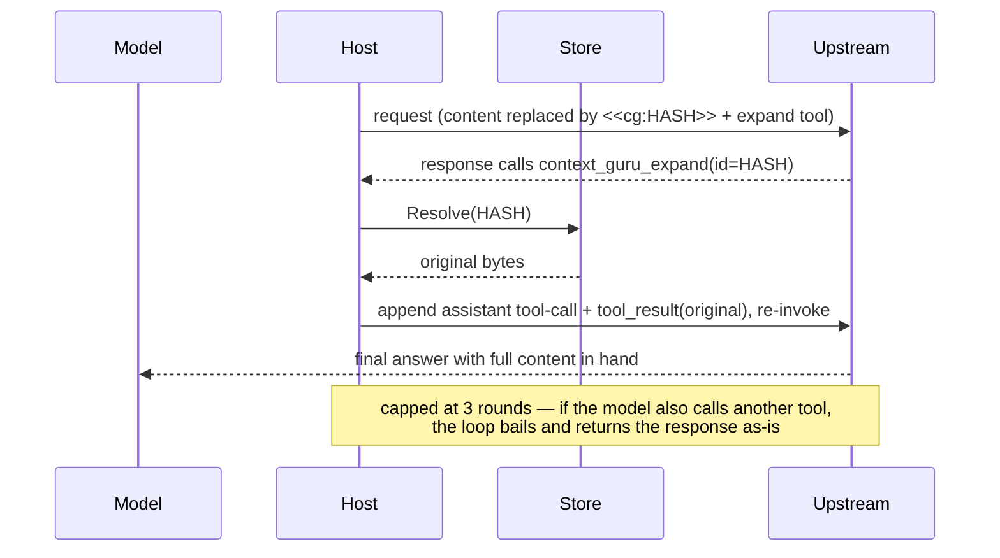

# Recover offloaded context

Every lossy [Offload](../components.md#offload-lossy-reversible) is reversible. When a component
drops bytes it writes a `<<cg:HASH>>` marker in place of the dropped content and stashes the
original in the [store](../design.md#state-the-store) under that hash. Nothing is ever silently
lost — an Offload that drops content but returns no cache key is treated as a failed offload and
reverted.

## The marker

```text
[older tool output masked] <<cg:b162e82de872a202>> [full output: call context_guru_expand]
```

The marker is the recovery handle. The model sees a short hint next to it, and the original bytes
live in the store keyed by the hash.

## Three ways to recover

### 1. The model-callable `context_guru_expand` tool
The host injects a `context_guru_expand(id)` tool into the request. When the model needs the full
content behind a marker, it calls the tool with the hash.

### 2. The host-side expand continuation loop
The host resolves the hash, appends the original as a tool result, and re-invokes upstream so the
model finishes with the full content in hand. The marker format, tool definition, response parsing,
and continuation builder are shared in `expand/`; the loop itself is host glue because it must
re-invoke upstream.



The loop is **capped at 3 rounds** (`maxExpandRounds = 3`). If the model calls another tool
alongside the expand call, the loop bails and returns the response as-is. An expired or evicted
original resolves to an explicit placeholder rather than being omitted — the provider requires one
`tool_result` per `tool_call_id`. A store miss silently turns a lossless offload lossy: the known
TTL edge.

### Streaming (SSE): what actually happens

The loop reasons over a complete assistant message, but a streaming response arrives as events, so
on SSE the proxy makes a per-request choice from the request bytes:

- **No marker in `messages`/`system`** → the model has nothing to expand, so the response is
  streamed straight through, byte for byte, with no added latency. This fast path only started
  working in [#33](https://github.com/rossoctl/context-guru/pull/33): the marker check tested the
  *whole* request body, which also matched the `context_guru_expand` tool description context-guru
  injects itself, so it was unconditionally true and **every** SSE response was buffered. Measured
  on a fake 1 s SSE upstream, medians of 12 trials: marker-free TTFB **1007 ms → 43 ms**;
  marker-bearing stayed at 1008 ms, which is correct — it is being inspected.
- **A marker is present** → the response is read in full, reconstructed with `expand.AggregateSSE`,
  and inspected. If it is a lone expand call the loop runs; otherwise the buffered bytes are
  replayed to the client verbatim.

Buffering costs the client its streaming for that request (time-to-first-byte becomes
time-to-last-byte), which is why the marker test is narrow. It scans **only** `messages` and
`system` — the model-visible content, via `expand.HasMarkersInMessages`. Requiring the full marker
shape would not have been enough on its own: the injected tool description contains the full shape
too, so **scoping** is the actual fix (issue #26).

!!! success "Restoration does fire through the streaming path"
    Worth stating, because a fast path that never buffers could equally mean restoration is
    unreachable. It is not: a real agent invoked restoration through the streaming path —
    `bounces=1`, 3,372 tokens re-served. The loop works end to end on SSE, not only in tests.

`/stats` reports this directly, counted **once per client request** (not per upstream round, so a
request that drove several expand rounds is one sample): `sse_streamed`, `sse_buffered`,
`sse_buffered_pct`, `sse_ttfb_ms_avg` and `sse_ttfb_ms_avg_buffered`. On traffic that never offloads,
`sse_buffered` stays 0; it starts counting from the first turn that carries a marker. Note that
`sse_ttfb_ms_avg_buffered` is time-to-*last*-byte by construction — a buffered response is read in
full before the client is written to — so it is not comparable to `sse_ttfb_ms_avg`.

!!! note "Markers usually arrive HTML-escaped"
    A marker the model reads as `<<cg:HASH>>` normally travels on the wire as
    `<<cg:HASH>>`: Go's `encoding/json` escapes `<` by default (callers can opt out
    with `Encoder.SetEscapeHTML(false)`, and some non-Go clients never escape it), and `sjson`
    escapes it whenever the value contains a newline — which is how every marker is appended. Any
    check matching markers against raw request bytes must accept both spellings, case-insensitively
    (`<` is as valid as `<`); `expand.rawMarkerRe` does, deliberately. A miss there is a
    false negative — a real expand call streamed past uninspected — which is worse than
    over-buffering.

    Because that matcher accepts the plain form too, a document or message quoting a literal
    `<<cg:HASH>>` example (like this page) counts as marker-bearing. That is the intended bias:
    over-inspect rather than miss a real call.

!!! warning "Streaming restoration is Anthropic-only"
    `expand.AggregateSSE` reconstructs the Anthropic Messages event stream only. A marker-bearing
    **OpenAI** streaming response cannot be reconstructed, so it is replayed raw (fail-open) and
    restoration does not fire on that request. Non-streaming OpenAI restoration works normally, as
    does streaming Anthropic. Every streaming coding agent in scope speaks the Anthropic dialect;
    OpenAI SSE aggregation will be added when a real agent needs it.

### 3. `GET /expand?id=`
The proxy exposes `GET /expand?id=<hash>` to recover an offloaded original directly, out of band
from the model loop.

## Reversibility requires the store

The store is the whole reversibility mechanism. It defaults to an in-memory TTL+LRU backend —
**10000s sliding TTL, 1000 entries, 100 sticky sessions** — shared by every host. The TTL is
refreshed on every read, so a stash an active session keeps touching does not expire under it.
It holds, per session:

- **Rewind** — `cache_key → original bytes`, what the expand loop resolves. Fully evictable: these
  are the large payloads.
- **Sticky** — the set of content ids already reduced on prior turns (byte-stable output across
  turns).
- **Frozen decisions** — the exact replacement bytes an offloader must replay so an already-cached
  message stays byte-identical (`cg:frz:` for `mask`/`failed_run`, `cg:res:` for `extract_llm`'s
  result, `cg:len:` for `apply`'s cache-boundary counter). These are **pinned** against LRU
  eviction, because losing one is not a cache miss — it flips a message inside the provider's
  cached prefix and the whole suffix is re-written at 11.5× the read price. The pin is capped at
  half `max_entries` so one pathological session cannot starve the rewind stashes.

A dropped frozen decision is re-derived where re-derivation is *reproducible* — `mask` and
`failed_run` qualify, since their replacement is a pure function of `(content, config)`.
`extract_llm` is deliberately excluded: its replacement is a **sampled** model output (no
temperature, no seed sent), so re-deriving could splice *different* bytes into a cached prefix,
which is the exact corruption the repair exists to prevent. Health counters:
`frozen_hits` / `frozen_misses` / `frozen_dropped` / `frozen_repaired` / `frozen_flips` — see
[Routes](../reference/routes.md#freeze-replay-health).

!!! warning "No store, no recovery"
    Set `store.enabled: false` and offloads become **one-way** — a `store.Nop` is wired in and
    nothing is stashed. The [llm-d compaction service](../examples/llm-d-service.md) does this
    deliberately (with `marker_mode: off`) so `/compact` returns a clean, marker-free,
    directly-usable request body. Only disable the store when you don't need to recover.
