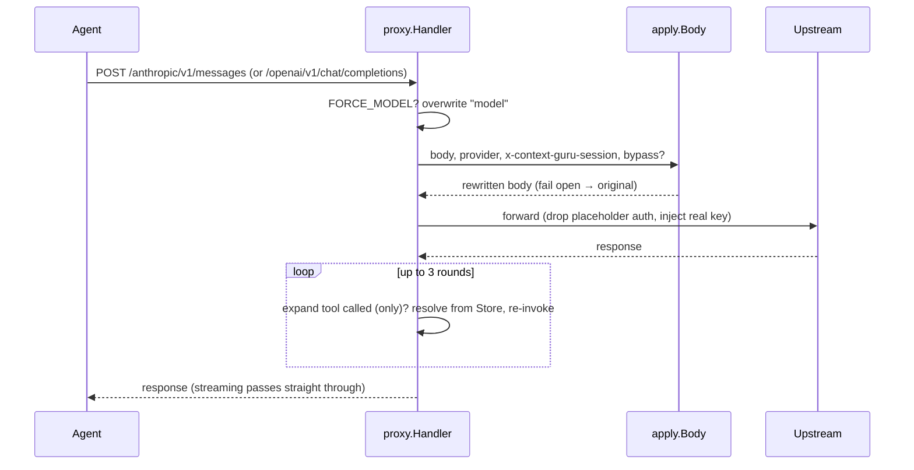
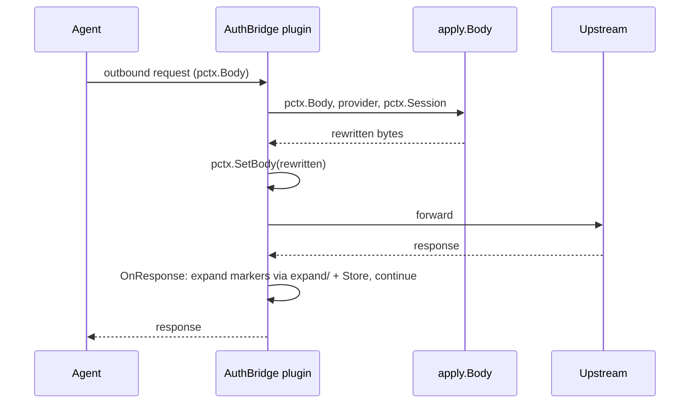

# Integrations

The same `components` core runs behind three host adapters. All of them ultimately call the
same pipeline over the same bifrost schema — hosts differ only in how they obtain the body,
provider, and session id, and how they run the expand loop.

| Option | Host code | Body source | Expand loop | Status |
|---|---|---|---|---|
| Proxy / gateway | `proxy/` + `cmd/context-guru-proxy/` | HTTP request body | server-side, wraps the chat route | shipped; the eval-containers gateway |
| AuthBridge plugin | `cortex` (imports this module) | `pctx.Body` | response path (`OnResponse`) | plugin lives externally |
| bifrost `LLMPlugin` | `adapters/bifrost/` | `req.ChatRequest` | transport wrapper | adapter shipped |

## Option A — proxy / gateway

`context-guru-proxy` is a direct HTTP proxy (it reuses bifrost's `ChatMessage` **type**, not
its transport). One port serves both dialects and forwards to the configured upstream, injecting
the real provider key in gateway mode.



Key behaviors (`proxy/proxy.go`):
- **Routes** — `POST /openai/v1/chat/completions`, `POST /anthropic/v1/messages`, `GET /healthz`,
  `GET /stats`, `GET /expand?id=`.
- **Gateway credential model** — when `OPENAI_API_KEY`/`ANTHROPIC_API_KEY` are set, the client's
  auth is dropped and the real key injected on forward (the agent holds only a placeholder).
  Empty keys → client auth passes through (local/dev).
- **`FORCE_MODEL`** pins every call's model (eval-containers `EVAL_MODEL`).
- **Expand loop** runs server-side before returning, capped at `maxExpandRounds = 3`. Streaming
  (`event-stream`) responses skip the loop and pass through with flushing.
- `x-context-guru-*` headers are stripped before forwarding upstream.

Run it: see the [README](../README.md) flag table and [setup.md](setup.md).

## Option B — AuthBridge in-process plugin

The plugin lives in **cortex** (`authlib/plugins/contextguru/`) and imports only this
module — not bifrost internals. It is an outbound `WritesBody` plugin gated to inference paths.



The plugin reuses `apply.Body` (bytes in → pipeline → bytes out), `session.Resolve` (from
`pctx.Session`), the shared `Store`, and `expand/` for the response-path continuation. Config
arrives as `json.RawMessage` into the same `config` struct the proxy uses; metrics surface via
AuthBridge's `StatsSource`.

## Option C — bifrost LLMPlugin (embed in a bifrost deployment)

`adapters/bifrost.Plugin` implements bifrost's `schemas.LLMPlugin`. Registering it via
`BifrostConfig.LLMPlugins` runs the pipeline as a `PreRequestHook` inside any bifrost proxy.

```go
p := bifrost.New(pipe, store)   // pipe from config.Build, store from config.NewStore
// register p in BifrostConfig.LLMPlugins
```

- `PreRequestHook` runs the pipeline over `req.ChatRequest` in place (the canonical mutate phase);
  non-chat requests pass through. It never aborts a request (fail-open is inside the pipeline).
- Session id comes from the `context-guru-session` context value (set by the transport from the
  header / Anthropic `metadata.user_id`), else the content-hash fallback.
- `PreLLMHook`/`PostLLMHook` are pass-throughs — the expand loop belongs in a transport wrapper
  (it must re-invoke upstream, which a hook cannot).
