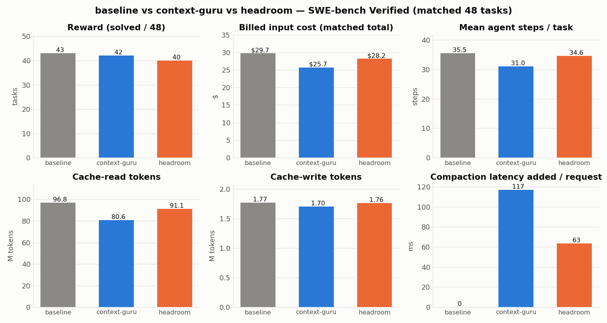
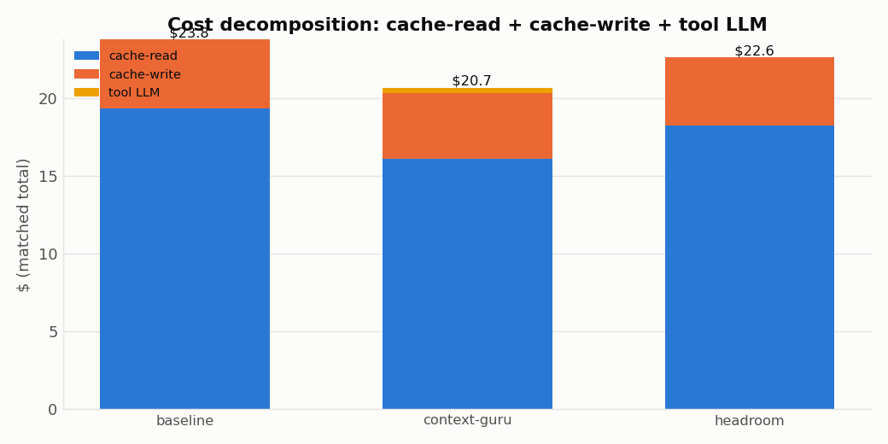
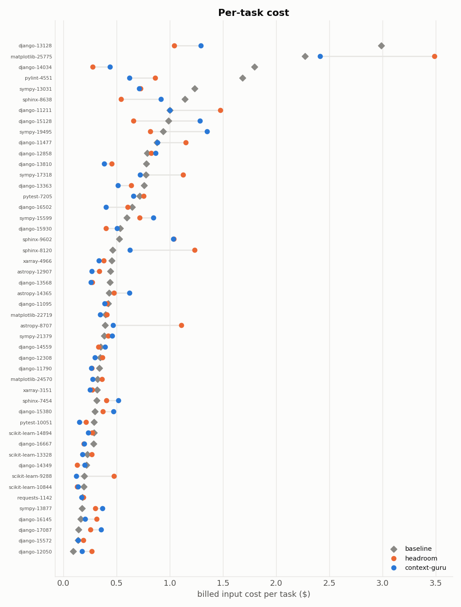
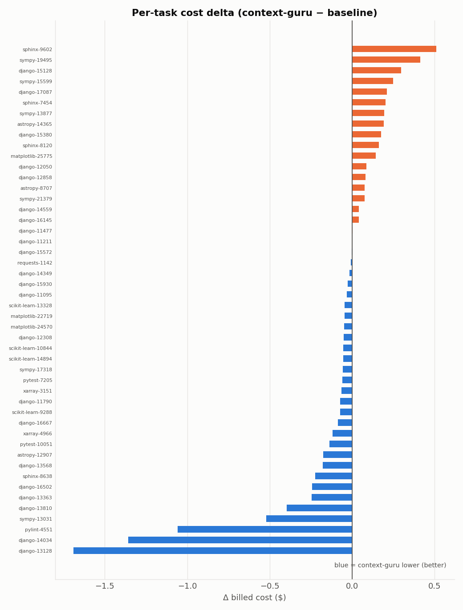
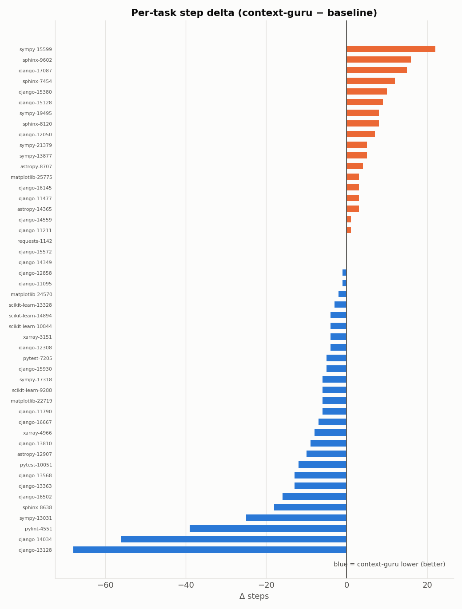
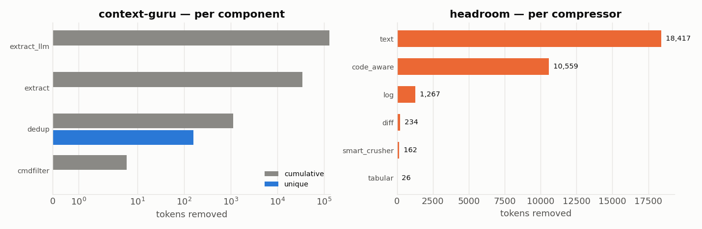

# Benchmark: context-guru vs headroom vs baseline

**SWE-bench Verified · 50 tasks · `claude-code` agent on `aws/claude-sonnet-5`**, run live
through each proxy. Everything below is the **matched set of 48 tasks** that scored (no
infrastructure exception) under all three arms, so every number is apples-to-apples on
the same tasks. Reproduce: [REPRODUCE.md](REPRODUCE.md). Per-config detail:
[baseline.md](baseline.md) · [context-guru.md](context-guru.md) · [headroom.md](headroom.md).
Component internals & real examples: [components.md](components.md).

Cache-aware billed **input** cost = fresh $2/M · cache-read $0.20/M · cache-write $2.50/M,
recomputed from each trial's own token tiers; output billed at $10/M. **Total** adds the
tool's own compaction-LLM cost.

## Headline

**context-guru is the cheapest and highest-reward compaction layer on this benchmark** —
it beats both the no-compaction baseline and headroom on billed cost, and beats headroom
on task reward.

| dimension | baseline `off` | **context-guru** | headroom | winner |
|---|--:|--:|--:|:--|
| reward (solved / 48) | 43 (90%) | **42 (88%)** | 40 (83%) | baseline ≈ **cg** > headroom |
| **total billed cost** | $29.73 | **$25.71 (−13.5%)** | $28.19 (−5.2%) | **context-guru** |
| cache-read tokens | 96.8M | **80.6M (−16.8%)** | 91.1M (−5.9%) | **context-guru** |
| cache-write tokens | 1.77M | **1.70M** | 1.76M | **context-guru** |
| cache-read $ | $19.36 | **$16.11** | $18.23 | **context-guru** |
| cache-write $ | $4.42 | **$4.25** | $4.41 | **context-guru** |
| cache-hit rate | 98.13% | 97.80% | 98.01% | ≈ tie |
| mean steps / task | 35.5 | **31.0** | 34.6 | **context-guru** |
| mean agent wall / task | 357 s | **334 s** | 337 s | **context-guru** |
| compaction added latency / req | — | 117 ms | **63 ms** | **headroom** |
| tool's own LLM cost | $0 | $0.31 | **$0** | **headroom** |
| raw content removed (per req) | 0 | 1.09% | **2.64%** | **headroom** |
| exceptions (of 50) | 0 | 2 | **0** | headroom |

### Verdict

- **context-guru wins the dollar metrics** — lowest billed cost ($25.71, **−13.5%** vs
  baseline; headroom −5.2%), lowest cache-read *and* cache-write, fewest steps. It also
  beats headroom on reward (42 vs 40).
- **headroom wins the overhead metrics** — half the added latency (63 vs 117 ms/req),
  zero tool cost, and more *raw* content removed (2.64% vs 1.09%) — all because it is
  **fully deterministic** (no model on the hot path).
- **Why context-guru is cheaper despite removing less content per request:** it
  **freezes each compaction and replays it byte-identically on every later turn**, so a
  reduction compounds across the whole session's cache-reads (−16.8% cache-read vs
  headroom's −5.9%). Removing a little from *every* turn's re-sent history beats removing
  more from one turn. It also drives the agent to **fewer steps** (31 vs 34.6), which
  compounds the saving further (a partial step-count effect — see the honest caveat).

> **Honest caveat.** Reward and step counts carry run-to-run agent nondeterminism at
> n=1/task. The **deterministic** signals — cache-**write** (−$0.17 vs baseline for
> context-guru: it does *not* bust the cache) and the per-component token reductions — are
> the fully trustworthy ones. The billed-cost win is real but partly amplified by
> context-guru's lower step count this run.

## Cost decomposition

Where every dollar goes (matched total): cache-read is the dominant term on a
~98%-cached agent; context-guru shrinks it the most, at the price of a small $0.31 haiku
bill; headroom adds no tool cost but shrinks cache-read less.

## Per-task

Per-task billed cost (baseline ◆ vs headroom ● vs context-guru ●) and the per-task deltas
vs baseline — context-guru is at/below baseline on nearly every task:

## Per-component / per-compressor

context-guru's savings come from `extract_llm` (LLM skeletonization of large file
reads/logs) + the deterministic `extract` (ANSI/CR + noise) + `cmdfilter`/`dedup`;
headroom's from its deterministic `text` and `code_aware` (AST) compressors. Cumulative
vs unique tokens (context-guru re-applies the same compaction every turn, so cumulative ≫
unique):

Full component internals, trigger conditions, and real before→after examples for both
tools are in **[components.md](components.md)**.
